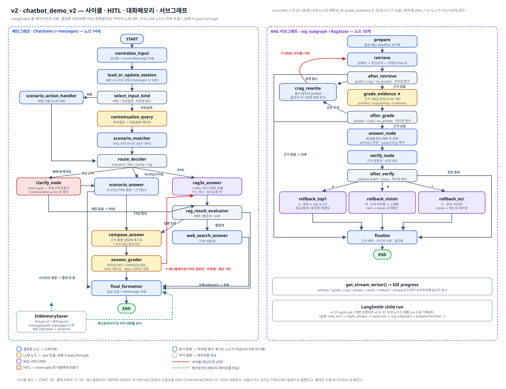

# 파이프라인 노드 학습 노트 — chatbot_demo_v2

> **용도**: `docs/pipeline_v2.svg` 를 띄워 놓고 발표·시연하기 전에 읽는 문서.
> 도식의 **박스 하나하나가 코드의 어디이고, 무엇을 읽어 무엇을 쓰고, 언제 되돌아가는지**를
> 실제 구현(2026-08-03 기준 — 웹검색 구현 반영)과 1:1로 대조해 정리했습니다.
>
> 관련 문서 — [파이프라인_비교.md](파이프라인_비교.md)(v1 대비 무엇이 늘었나) ·
> [../README.md](../README.md)(실행·운영) · [../2차_개선_보고서.md](../2차_개선_보고서.md)(왜 이렇게 바뀌었나)



---

## 목차

1. [30초 요약 — 도식 읽는 법](#1-30초-요약--도식-읽는-법)
2. [메인그래프 노드 14개](#2-메인그래프-노드-14개)
3. [RAG 서브그래프 노드 10개](#3-rag-서브그래프-노드-10개)
4. [콜백 지도 — 언제 되돌아가고 언제 밖으로 알리는가](#4-콜백-지도--언제-되돌아가고-언제-밖으로-알리는가)
5. [플로우 워크스루 6종](#5-플로우-워크스루-6종)
6. [상태(State) 읽는 법](#6-상태state-읽는-법)
7. [임계값·예산 치트시트](#7-임계값예산-치트시트)
8. [시연 대본](#8-시연-대본)
9. [예상 질문 대응](#9-예상-질문-대응)
10. [도식과 코드가 다른 지점 — 발표 전 주의](#10-도식과-코드가-다른-지점--발표-전-주의)

---

## 1. 30초 요약 — 도식 읽는 법

### 1.1 그래프는 두 개다

| | 메인그래프 | RAG 서브그래프 |
|---|---|---|
| 상태 스키마 | `ChatState` (+`messages`) | `RagState` |
| 노드 수 | **14** | **10** |
| 체크포인터 | `InMemorySaver` (턴 간 대화 유지) | **없음** (단발 실행) |
| 코드 | [graph/nodes.py](../graph/nodes.py) · [graph/builder.py:104](../graph/builder.py#L104) | [graph/rag_nodes.py](../graph/rag_nodes.py) · [graph/builder.py:43](../graph/builder.py#L43) |
| 진입점 | 사용자 요청 1건 = 1턴 | 메인그래프의 `rag3x_answer` 노드 |

서브그래프는 **별도의 Pregel 루프**로 돕니다. 이 사실이 뒤에서 스트리밍 콜백 구조를
결정합니다(§4.3).

### 1.2 색 = 비용과 위험

| 색 | 의미 | 이 색 노드가 실패하면 |
|---|---|---|
| 🔵 파랑 `#e8f0fe` | **결정론 노드 — LLM 0회** | 예외 → HTTP 에러(입력 검증 노드) 또는 빈 결과 |
| 🟡 노랑 `#fef3c7` | **LLM 노드** — `.env` 토글로 끌 수 있음 | **pass-through** — 원문/초안 그대로 통과, 답변은 반드시 나감 |
| 🟣 보라 `#ede9fe` | RAG 서브그래프 관련 | — |
| 🔴 빨강 `#fee2e2` | **HITL** — `interrupt()` 로 사람에게 되묻기 | — |
| ⬜ 회색 `#f1f5f9` | 분기 판정 | — |

> **발표 한 줄**: "파란 경로(버튼·FAQ 정확일치)는 v1 과 똑같이 LLM 을 **한 번도** 부르지 않습니다.
> 노란 노드는 전부 꺼도 서비스가 돌아갑니다."

### 1.3 회색 박스는 두 종류가 섞여 있다 ⚠

도식의 회색 박스는 전부 "분기"처럼 보이지만, 실제로는 **노드**와 **순수 함수**가 섞여 있습니다.
그래서 최종본에서는 노드가 아닌 것에 **`· 라우팅 함수`** 라고 표기해 두었습니다.

| 도식의 회색 박스 | 정체 | 코드 |
|---|---|---|
| `select_input_kind` | **라우팅 함수**(노드 아님) | [graph/routing.py:12](../graph/routing.py#L12) |
| `route_decider` | **노드** (판정 + trace 기록) | [graph/nodes.py:351](../graph/nodes.py#L351) |
| `rag_result_evaluator` | **노드** (판정 + 경고문구 적재) | [graph/nodes.py:547](../graph/nodes.py#L547) |
| `after_retrieve` / `after_grade` / `after_verify` | **라우팅 함수** | [graph/rag_nodes.py:429](../graph/rag_nodes.py#L429) |

차이가 중요한 이유 — **노드만 LangSmith 에 run 으로 찍히고, 노드만 SSE `node` 이벤트를
발생시킵니다.** 라우팅 함수는 상태를 바꾸지 않고 다음 노드 이름(문자열)만 반환합니다.
시연 중 파이프라인에 불이 켜질 때 회색 `after_*` 박스가 안 켜지는 이유가 이것입니다.

### 1.4 큰 흐름 한 문장

```
입력 정규화 → 세션 정리 → (버튼이면 트리 이동 / 자유입력이면 후속질문 재작성 → FAQ 의미매칭)
→ 라우팅 4분기 { 시나리오 · FAQ · 되묻기(HITL) · RAG }
→ [RAG 면 서브그래프 10노드] → 답변 합성 → 해결도 판정 → 최종 조립 → END
```

---

## 2. 메인그래프 노드 14개

각 노드는 `ChatState` **부분 업데이트 dict** 를 반환합니다. 엔진·락 같은 비직렬화 객체는
상태에 넣지 않고 `ctx` 클로저로 접근합니다.

---

### ① `normalize_input` 🔵

| 항목 | 내용 |
|---|---|
| **한 줄** | 턴을 시작하고, 입력을 검증·정규화하고, 사용자 발화를 대화 이력에 적재 |
| **코드** | [graph/nodes.py:194](../graph/nodes.py#L194) |

**하는 일**

1. `new_turn_defaults()` 로 **per-turn 필드를 전부 초기화**합니다.
   → 여기서 `messages`, `scenario_*` 는 **건드리지 않습니다**. 이 한 줄이 대화 기억의 전제입니다.
2. `_turn_started_at` 기록 (최종 `timings.total_s` 의 기준점).
3. 버튼 입력이면: `action.type == "scenario_option"` 인지, `node_id`/`option_id` 가 있는지 검사
   → 없으면 `InvalidActionError` → **HTTP 400**.
4. 자유 입력이면: 빈 문자열이면 `EmptyInputError` → **HTTP 400**.
   `normalize_text()` 로 NFKC 정규화 · 소문자화 · 공백/구두점 정리 → `normalized_question`.
5. `messages` 에 `HumanMessage(content=원문)` 추가 (`add_messages` 리듀서가 누적).

> **주의**: `messages` 에 들어가는 건 **정규화 전 원문**입니다. 정규화본은 매칭 전용입니다.

---

### ② `load_or_update_session` 🔵

| 항목 | 내용 |
|---|---|
| **한 줄** | 시나리오 위치(버튼 트리에서 어디까지 왔는지)를 유지할지 끊을지 결정 |
| **코드** | [graph/nodes.py:226](../graph/nodes.py#L226) |

- **자유 입력**: `scenario_id`/`current_node_id` = `None`, `scenario_path` = `[]`, `completed` = `False`
  → **이전 버튼 위치가 자유질문 라우팅에 영향을 주지 못하게 끊습니다.**
- **버튼 입력**: 그대로 유지.
- 어느 쪽이든 **`messages` 는 절대 초기화하지 않습니다.**

> 시나리오 트리를 타다가 자유질문을 던지면 트리에서 빠져나오지만, **대화 기억은 남습니다.**
> 시연에서 "버튼 → 자유질문 → 후속질문" 순서가 자연스럽게 이어지는 이유입니다.

---

### ▸ `select_input_kind` ⬜ *(라우팅 함수 — 노드 아님, 번호 없음)*

| 항목 | 내용 |
|---|---|
| **코드** | [graph/routing.py:12](../graph/routing.py#L12) |

```python
return "action" if state.get("input_type") == "action" else "text"
```

`action` → `scenario_action_handler` / `text` → `contextualize_query`.

---

### ③ `scenario_action_handler` 🔵

| 항목 | 내용 |
|---|---|
| **한 줄** | 버튼 클릭 = 시나리오 트리 이동. **LLM 0회, 검색 0회, 수 ms** |
| **코드** | [graph/nodes.py:246](../graph/nodes.py#L246) |

1. `tree.resolve_option(node_id, option_id)` → 다음 노드. 잘못된 조합이면 `InvalidActionError`(400).
2. `option_id == "__restart__"` 이거나 루트로 가면 `scenario_path` 리셋.
3. 그 외에는 버튼 라벨을 `scenario_path` 에 누적(빵부스러기).
4. 도착 노드가 종단(`is_terminal`)이면 `scenario_completed = True`.
5. LangSmith 메타데이터 `from_node → to_node`, 태그 `scenario_nav` 부착.

> **이 노드는 `scenario_matcher` 를 건너뛰고 곧장 `route_decider` 로 갑니다.** 버튼은 이미
> 무엇을 원하는지 확정된 입력이라 매칭할 것이 없습니다.

---

### ④ `contextualize_query` 🟡 *(LLM 1회)*

| 항목 | 내용 |
|---|---|
| **한 줄** | "그거 어떻게 해요?" 같은 **앞 턴 의존 질문을 독립 질문으로 재작성** |
| **코드** | [graph/nodes.py:285](../graph/nodes.py#L285) · 프롬프트 [prompts/contextualize.md](../prompts/contextualize.md) |

**게이트 3개가 전부 참일 때만 LLM 을 부릅니다.**

| 게이트 | 값 |
|---|---|
| 자유 입력인가 | `input_type == "text"` |
| 토글 | `CONTEXTUALIZE_ENABLED` (기본 `true`) |
| 후속 질문인가 | `messages` 안의 `HumanMessage` 가 **2건 이상** (= 이번 턴 것 + 이전 턴 것) |

**동작**: 직전까지의 이력을 `"사용자: … / 상담봇: …"` 형태로 **최근 2000자**만 잘라 프롬프트에
넣고, 응답의 **첫 줄만** 사용합니다(모델이 설명을 덧붙이는 경우 방어).

**출력**

- 재작성됨 → `standalone_question` + **`normalized_question` 도 재계산**
  → ⚠ **재작성된 질문으로 FAQ 매칭이 이뤄집니다.** 이게 이 노드의 진짜 파급력입니다.
- 재작성 불필요/실패 → `standalone_question = 원문`, `contextualized = False` (**pass-through**)

> **실측 예시**(트레이스 2턴차): "나는 대구에 있는 고등학교에 다니는 선생님이야"
> → "대구에 있는 고등학교에 근무하는 선생님인데, **갤럭시 기기의 인터넷 속도가 느린 문제**에
> 대해 어디로 문의해야 하나요?" — 사용자가 이번 턴에 말하지 않은 주제를 앞 턴에서 끌어왔습니다.

---

### ⑤ `scenario_matcher` 🔵 *(LLM 0회, 임베딩+리랭커)*

| 항목 | 내용 |
|---|---|
| **한 줄** | 질문이 **236행 FAQ(모범 질답)** 중 하나와 같은 뜻인지 점수로 판정 |
| **코드** | [scenario/matcher.py:170](../scenario/matcher.py#L170) (`SemanticScenarioMatcher`) |

**절차**

```
정규화 질문
 → ① 정확 일치(dict 조회, 비용 0)          → decision="exact", best=1.0
 → ② 임베딩 코사인 top-10 회수              (Ollama EmbeddingGemma, 로컬)
 → ③ BGE-reranker-v2-m3 로 재점수           (RAG 와 동일 스택)
 → ④ best / second / margin(=best-second) 계산
```

**판정 4종**

| decision | 조건 | 다음 |
|---|---|---|
| `exact` | 정규화 문자열 완전 일치 | FAQ 즉답 |
| `accept` | `best ≥ 0.80` **AND** `margin ≥ 0.30` | FAQ 즉답 |
| `reject_ambiguous` | `best ≥ 0.80` 이지만 `margin < 0.30` | 되묻기 후보 |
| `reject_low_score` | `best < 0.80` | 되묻기 후보(회색지대) 또는 RAG |

> **왜 margin 이 핵심인가**: 크로스인코더 점수는 0/1 로 몰려서 `best` 만으로는 모호한 질문과
> 정답 매칭이 구분되지 않습니다("비밀번호를 바꾸고 싶어요" = 0.971). 골든셋 실측에서
> ambiguous 표본의 margin 최대값이 0.272 였기에 **0.30** 을 자동채택 문턱으로 잡았습니다.

**폴백**: `faq_embeddings.json` 이 없거나 백엔드가 죽으면 **조용히 문자 유사도(`fuzz.ratio`)로
전환**하고, 임계값도 스케일에 맞춰 `0.90 / 0.05` 로 바꿉니다. 결정론 경로가 죽지 않습니다.

---

### ⑥ `route_decider` ⬜ *(노드)*

| 항목 | 내용 |
|---|---|
| **한 줄** | 4개 경로 중 하나를 고르는 **파이프라인의 분수령** |
| **코드** | [graph/nodes.py:351](../graph/nodes.py#L351) → 판정 로직 [graph/routing.py:54](../graph/routing.py#L54) |

| 우선순위 | 조건 | route | 다음 노드 |
|---|---|---|---|
| 1 | `input_type == "action"` | `scenario` | `scenario_answer` |
| 2 | `decision ∈ {exact, accept}` | `faq` | `scenario_answer` |
| 3 | `clarify_enabled` ∧ `best ≥ 0.35` ∧ `decision == reject_ambiguous` | `clarify` | `clarify_node` |
| 4 | `clarify_enabled` ∧ `best ≥ 0.35` ∧ `decision == reject_low_score` | `clarify` | `clarify_node` |
| 5 | 그 외 | `rag3x` | `rag3x_answer` |

**3번과 4번의 차이가 이번 개선의 핵심입니다.**

- 3번(애매) = 후보 1·2위 점수가 붙어 있다 → 예전부터 있던 되묻기.
- 4번(**회색지대**) = 자동채택엔 못 미치지만 완전 무관은 아닌 구간 → **2026-07-27 신설**.
  이전에는 이 구간이 전부 RAG 로 직행해 **한 가지 해석만 골라 답했습니다.**
  발단 질문 "학교에서 새로운 ap를 설치하고 싶어"(best 0.386)가 정확히 여기입니다.

**스케일 보정**: 매처가 fuzz 로 폴백하면 `match["scale"] == "fuzz"` 가 되므로 되묻기 하한을
`0.35 → 0.75` 로 자동 상향합니다. 의미 유사도 임계를 문자 유사도에 그대로 쓰면 오작동합니다.

---

### ⑦ `clarify_node` 🔴 *(HITL — 실행이 멈추는 유일한 노드)*

| 항목 | 내용 |
|---|---|
| **한 줄** | 상위 후보 2개를 보여주고 **사용자가 고를 때까지 그래프를 정지** |
| **코드** | [graph/nodes.py:365](../graph/nodes.py#L365) |
| **반환형** | `dict` 가 아니라 **`Command`** (goto + update 동시 지정) |

**정지 단계**

1. `matcher.top_candidates(k=2)` 로 후보 조회.
2. `interrupt({"type": "clarify", "candidates": [...]})` 호출 →
   **Pregel 루프가 여기서 멈추고 체크포인트에 상태를 저장**합니다.
3. `graph.invoke()` 결과에 `__interrupt__` 키가 담겨 돌아옵니다.
4. API 가 이를 감지해 `type="clarify"` 응답으로 후보 버튼을 내려보냅니다
   ([app/api.py:146](../app/api.py#L146), [app/api.py:175](../app/api.py#L175)).

**재개 단계**

5. 사용자가 버튼 클릭 → `POST /api/chat` with `clarify_response.choice`
6. 서버가 **같은 `thread_id`** 로 `graph.invoke(Command(resume={"choice": ...}), config)`
7. ⚠ **`clarify_node` 가 처음부터 다시 실행됩니다.** `interrupt()` 이전 코드(=후보 조회)는
   재실행되므로 **여기에 부작용을 두면 안 됩니다.** (코드 주석에 명시된 규칙)
8. 분기:

| 사용자 선택 | 처리 | `Command(goto=...)` |
|---|---|---|
| 후보 FAQ 선택 | `scenario_match` 를 `decision="accept", best_score=1.0` 으로 **덮어씀** | `scenario_answer` |
| "해당 없음"(`__none__`) | 그대로 | `rag3x_answer` |

> `Command(goto=...)` 를 쓰기 때문에 **`clarify_node` 에서 나가는 정적 엣지가 없습니다.**
> 도식의 두 화살표(후보 선택 / 해당 없음)는 런타임에 결정되는 동적 경로입니다.

---

### ⑧ `scenario_answer` 🔵 *(LLM 0회)*

| 항목 | 내용 |
|---|---|
| **한 줄** | 저장된 **원문 답변**을 그대로 꺼내온다 (시나리오 트리 or FAQ) |
| **코드** | [graph/nodes.py:413](../graph/nodes.py#L413) |

**A. 버튼 경로** — `tree.get_node(current_node_id)`

- 종단 노드 → `answer_text` + 다음 옵션 버튼
- 중간 노드 → `text`(질문 문구) + 선택지 버튼
- `answer_source = "scenario_tree"`, `confidence = "n/a"`

**B. FAQ 경로** — `faq.get(matched_id)`

- `final_answer` = 엑셀 모범답변 **원문 그대로**, 동시에 `original_answer` 에도 보관
  (합성이 폐기될 때 되돌아갈 원본)
- `faq_evidence` = **근거 페이지 이미지**를 복사해 URL 로 노출 (최대 3장, **LLM 0회 · 파일 복사만**)
  → `faq_doc_links.json` 에 빌드 시점에 저장해 둔 상대경로만 사용하므로 RAG 엔진 로딩이 불필요
- `source_meta` 에 시트/행/번호/질문유형/장애유형/근거문서 목록
- `answer_source = "faq_match"`

**분기** — [graph/routing.py:44](../graph/routing.py#L44)

```python
return "compose_answer" if answer_source == "faq_match" else "final_formatter"
```

> **왜 시나리오 버튼 답변은 합성하지 않나**: 버튼 종단 답변은 **검증된 절차 안내문**입니다.
> LLM 이 다시 쓰면 문장은 부드러워지지만 절차가 흐려질 위험이 있어 원문을 유지합니다.

---

### ⑨ `rag3x_answer` 🟣 *(RAG 서브그래프 호출)*

| 항목 | 내용 |
|---|---|
| **한 줄** | 어댑터를 통해 **RAG 서브그래프 10노드를 통째로 실행**하고 결과 dict 를 받는다 |
| **코드** | [graph/nodes.py:490](../graph/nodes.py#L490) · 어댑터 [rag/adapter_util.py:302](../rag/adapter_util.py#L302) |

**노드가 하는 일 (3가지)**

1. 질문 확정: `standalone_question` 우선, 없으면 `user_input`
   → **후속질문 재작성 결과가 여기서 RAG 에 전달됩니다.**
2. `_writer()` 로 현재 스트림 writer 를 잡아 `progress=_emit` **콜백으로 어댑터에 넘김**(§4.3).
3. `traced_call("rag3x.ask", ...)` 로 LangSmith child run 생성.

**어댑터(`SubgraphRagAdapter`)가 하는 일 — 도식 우측 하단 "TTL 캐시 · 동시요청 락"**

| 단계 | 동작 |
|---|---|
| ① 캐시 조회 | 질문을 소문자·공백정규화한 키로 조회. TTL **3600초**, 최대 64건(초과 시 최고령 제거) |
| ② 캐시 히트 | **락을 잡지 않고 즉시 반환** → 다른 사람이 RAG 처리 중이어도 429 없이 답변 |
| ③ 캐시 미스 | `_ask_lock.acquire(blocking=False)` → 실패 시 **`RagBusyError` → HTTP 429** |
| ④ 실행 | `with metrics.run_metrics(m): subgraph.invoke(...)` |
| ⑤ 정규화 | `normalize_rag_result()` — **절대경로 제거**, 근거 이미지를 `/evidence/{run_id}/…` 로 사본 |

> **락이 non-blocking 인 이유**: GPU 단일 처리라 큐잉하면 뒤 요청이 무한정 대기합니다.
> 기다리게 하느니 **즉시 429 로 거절**하는 편이 데모에서 정직합니다.

---

### ⑩ `rag_result_evaluator` ⬜ *(노드)*

| 항목 | 내용 |
|---|---|
| **한 줄** | RAG 결과를 **채택 / 웹검색 / 보류** 중 하나로 판정 |
| **코드** | [graph/nodes.py:547](../graph/nodes.py#L547) → 판정 [graph/routing.py:99](../graph/routing.py#L99) |

```
has_answer = final_answer 가 비어 있지 않다 AND answer_path ∉ {"none", None}
```

| 조건 | route | 결과 |
|---|---|---|
| `has_answer` ∧ 신뢰도 정상 | `rag3x` | → `compose_answer` |
| `has_answer` ∧ (`confidence ∈ {abstain, low, unknown}` 또는 `verification.abstain`) | `rag3x` | → `compose_answer` **+ 저신뢰 경고문구 적재** |
| `¬has_answer` ∧ 웹검색 활성 | `web_search` | → `web_search_answer` |
| `¬has_answer` ∧ 웹검색 비활성 | `abstain` | → `final_formatter`(정중한 거절) |

> **설계 원칙**: "저신뢰"라고 답변을 **폐기하지 않습니다.** 답변이 실제로 있으면 제시하되
> 주의 문구를 덧붙입니다. v1 에서 `is_abstain` 오탐 때문에 멀쩡한 답변이 통째로 버려졌던
> 사고에 대한 대응입니다([2차_개선_보고서 §2](../2차_개선_보고서.md)).

---

### ⑪ `web_search_answer` 🟡 *(LLM 1회 게이트 + 웹검색 · 기본 OFF)*

| 항목 | 내용 |
|---|---|
| **한 줄** | 내부 자료로 못 답한 **'상담 범위 안'** 질문만 웹검색으로 보완하는 마지막 보루 |
| **코드** | [graph/nodes.py:601](../graph/nodes.py#L601) · 게이트 [graph/nodes.py:594](../graph/nodes.py#L594) · 판정 파서 [graph/routing.py:142](../graph/routing.py#L142) |
| **프로바이더** | [web_search/gemini_grounding.py](../web_search/gemini_grounding.py) — Gemini + Google 검색 grounding (기본은 `DisabledWebSearchProvider`) |
| **API 키** | `WEB_SEARCH_GEMINI_API_KEY`(웹검색 전용) → 없으면 `GEMINI_API_KEY` 로 폴백. 검색 grounding 은 **결제 티어 전용**이라 무료 키로 부르면 `429 RESOURCE_EXHAUSTED` 다(2026-08-03 실측). `/api/health` 의 `web_search.key_source` 로 어느 키가 쓰이는지 확인 |
| **프롬프트** | [prompts/web_domain_gate.md](../prompts/web_domain_gate.md)(게이트) · [prompts/web_search.md](../prompts/web_search.md)(검색 지시문) |

**진입점이 2개입니다** — 둘 다 "내부에서 답을 못 얻었다"는 신호지만 모양이 다릅니다.

```
① rag_result_evaluator — RAG 가 답변 자체를 못 만듦(빈 답 / answer_path=none)
② answer_grader        — 답변은 나왔지만 UNRESOLVED    ← 실사용의 대표 반려 형태
                          ("제공된 자료에서 확인할 수 없습니다" 류)
```

**그리고 호출 전에 아래를 모두 통과해야 합니다.**

```
③ WEB_SEARCH_ENABLED=true
④ 도메인 게이트 = IN_DOMAIN         ← LLM 1회. '판정 불가(무응답)'도 차단한다
⑤ 하루 호출 상한(WEB_SEARCH_DAILY_BUDGET) 이내
```

| 결과 | route | 사용자에게 보이는 것 |
|---|---|---|
| 게이트 `IN_DOMAIN` ∧ 검색 성공 | `web_search` | 웹 답변 + 출처 링크 + "웹 검색 결과" 경고 |
| 게이트 `OUT_OF_DOMAIN` / 판정 불가 | 직전 답변 있으면 `rag3x`, 없으면 `abstain` | 검색 **호출 없이** 직전 답변 또는 정중한 거절 |
| 검색 실패 · 출처 0건 | 직전 답변 있으면 `rag3x`, 없으면 `abstain` | 위와 같음(웹 답변은 폐기) + **반려 사유** |

**반려 모양이 3가지인데 화면에서 구분이 안 됐습니다(2026-08-04 수정)**

| 반려 | 어디서 | 인스펙터에 뜨는 사유 |
|---|---|---|
| HTTP 429 등 호출 실패 | [gemini_grounding.py:199](../web_search/gemini_grounding.py#L199) | `웹검색 호출 실패(HTTP 429)` |
| 200 이지만 **출처(groundingChunks) 0건** | [gemini_grounding.py:230](../web_search/gemini_grounding.py#L230) | `웹 검색 근거를 확보하지 못해 답변을 보류했습니다.` |
| 검색은 했지만 빈 답 | `_parse` | `웹 검색에서도 답변을 찾지 못했습니다.` |

> 두 번째가 특히 헷갈립니다 — 모델이 검색을 타지 않고 **내부지식으로** 답한 경우라, 근거가 없어
> 답변을 통째로 버립니다. 예전에는 이때 로그에만 남아서 "검색은 된 것 같은데 답변에 반영이 안
> 된다"로 보였습니다. 원인은 `route == "web_search"` 일 때만 `web_result` 를 응답에 실은 것 —
> 반려되면 route 가 `rag3x` 로 되돌아가면서 **시도 자체가 통째로 사라졌습니다**. 지금은
> ⑭ `final_formatter` 가 채택 여부와 무관하게 `source_meta.web` 을 붙입니다.

> **왜 "직전 답변으로 되돌아가기"가 필요한가**: ②경로로 들어오면 이미 저신뢰 RAG 답변이
> 손에 있습니다. 웹검색이 실패했다고 그 답변까지 버리면 사용자 입장에서는 **개선이 아니라
> 후퇴**입니다. 그래서 웹검색은 **덧붙이는 시도**이고, 실패해도 손해가 없습니다.

> **왜 게이트를 두었나**: 검색은 **1회당 과금**되고(월 5,000회 무료 후 $14/1,000회),
> 잡담·타분야 질문까지 웹에서 답하면 상담봇의 역할 경계가 무너집니다. 게이트 자체는
> 검색을 타지 않는 텍스트 호출이라 사실상 무료입니다. 하루 상한(`WEB_SEARCH_DAILY_BUDGET`,
> 기본 100회)을 넘으면 호출 자체를 하지 않습니다.
>
> 웹 답변을 채택할 때는 **"내부 자료가 아닌 웹 검색 결과"** 경고와 출처 링크를 함께
> 내려보내고, Google 약관에 따라 '검색 추천'(searchEntryPoint)을 인스펙터에 표시합니다.
> `WEB_SEARCH_SCOPE=any_unresolved` 로 두면 게이트를 건너뜁니다(실험용 — 비용 주의).

---

### ⑫ `compose_answer` 🟡 *(LLM 1회 + 결정론 환각가드)*

| 항목 | 내용 |
|---|---|
| **한 줄** | 원문/초안을 **근거 기반 상담체로 재구성**하고, 근거 밖 숫자가 생기면 **합성을 폐기** |
| **코드** | [graph/nodes.py:579](../graph/nodes.py#L579) |

**진입 조건**: `route ∈ {faq, rag3x}` ∧ 해당 토글 ON ∧ LLM/프롬프트 사용 가능

| route | 프롬프트 | 입력 |
|---|---|---|
| `faq` | [composer_faq.md](../prompts/composer_faq.md) | 모범답변 원문 + 질문 + 이력요약(800자) |
| `rag3x` | [composer_rag.md](../prompts/composer_rag.md) | 근거 페이지 텍스트 + 엔진 초안 + 질문 + 이력요약 |

**환각가드 (LLM 0회, 결정론)** — 이 노드의 진짜 핵심

```
unsupported = check_claims_supported(합성문, 근거 + 초안 + 프롬프트 템플릿 원본)
if unsupported:  합성 폐기 → composed=False, composer_fallback 에 사유 기록 → 원문 유지
```

- 검사 대상: **3자리 이상 숫자**와 코드 토큰(1~2자리 순번은 노이즈라 제외)
- ⚠ **검증 컨텍스트에 "프롬프트 템플릿 원본"을 넣는 이유**: 템플릿에 우리가 박아 둔 상수
  (지원센터 `1899-0979`)가 들어 있어, 이걸 빼면 모델이 **지시를 따라 그 번호를 안내했을 때**
  "근거 밖 수치"로 오탐해 정상 합성을 폐기합니다(실측 확인). 템플릿은 치환 전이라 사용자
  입력은 포함되지 않습니다.

**출처 표기 정리** (RAG 경로만) — [graph/nodes.py:39](../graph/nodes.py#L39)

`[p53]` 표기를 실제 근거 페이지 번호와 대조해서,

- 근거에 **있는** 쪽번호 → 그대로 두고 `citations` 배열에 수집 (프론트가 근거 이미지 링크로 렌더)
- 근거에 **없는** 쪽번호 → **표기만 제거**하고 문장은 남김(내용 자체는 다른 근거에서 왔을 수 있음)

**실패 시**: `composed=False` 로 두고 원문/초안 그대로 통과 — **답변은 반드시 나갑니다.**

---

### ⑬ `answer_grader` 🟡 *(LLM 1회 — 에스컬레이션 사이클의 출발점)*

| 항목 | 내용 |
|---|---|
| **한 줄** | 답변이 질문을 **실질적으로 해결했는지** 한 단어로 판정 |
| **코드** | [graph/nodes.py:666](../graph/nodes.py#L666) · 프롬프트 [answer_grader.md](../prompts/answer_grader.md) |

**판정 기준** (프롬프트에 정의)

- `RESOLVED` — 질문이 요구한 정보·조치를 구체적으로 제공
- `UNRESOLVED` — 주제는 비슷하나 **핵심 정보가 빠졌거나**, 다른 곳에 문의하라는 안내뿐이거나,
  "확인 불가"류로 회피

> ⚠ **파싱 함정**: `"UNRESOLVED"` 안에 `"RESOLVED"` 가 substring 으로 들어 있습니다.
> 코드는 반드시 `UNRESOLVED` 를 **먼저** 검사합니다([graph/nodes.py:694](../graph/nodes.py#L694)).
> 면접·질의응답에서 좋은 디테일입니다.

**경로별 처리가 다릅니다**

| route | `unresolved` 일 때 | 이유 |
|---|---|---|
| `faq` | **RAG 로 에스컬레이션**(`_escalate=True`, 예산 1→0, `composed_answer` 리셋) | FAQ 로 못 풀었으면 원문 검색이 더 나을 수 있음 |
| `rag3x` | **RAG 재시도는 안 함.** `confidence="low"` 강등 + 경고문구, 그리고 **웹검색이 켜져 있으면 [⑪ web_search_answer](#⑪-web_search_answer-🟡-llm-1회-게이트--웹검색--기본-off) 로** | 같은 질문으로 RAG 를 다시 돌리면 결과가 같고 지연만 2배(캐시가 있으면 완전히 동일). 내부 자료로 안 되는 질문이므로 **밖에서** 찾는 것이 유일하게 남은 수 |

> **2026-08-03 추가 — 여기가 웹검색의 진짜 진입점입니다.** 실사용의 반려는 빈 답변이 아니라
> "제공된 자료에서 확인할 수 없습니다" 류 **답변**으로 나타납니다. 그러면 `rag_result_evaluator`
> 는 "답변 있음"으로 보고 통과시키므로, 웹검색은 이 grader 판정 뒤에 붙어야 실제로 발동합니다
> (분기 [graph/routing.py:49](../graph/routing.py#L49)).
> 웹검색이 게이트에 막히거나 빈손이면 **직전 답변으로 되돌아갑니다** — 있는 답을 버리지 않습니다.

**건너뛸 때 `grader_verdict` 를 덮어쓰지 않습니다** — 에스컬레이션으로 RAG 재시도 중이면
1차(FAQ) 판정 기록이 최종 상태에 남아야 관측이 가능하기 때문입니다.

---

### ⑭ `final_formatter` 🔵

| 항목 | 내용 |
|---|---|
| **한 줄** | route 별로 최종 응답을 조립하고, **답변을 대화 이력에 적재**하고, 관측 메타데이터를 붙인다 |
| **코드** | [graph/nodes.py:836](../graph/nodes.py#L836) |

| route | 최종 답변 | 근거 |
|---|---|---|
| `scenario` | `scenario_answer` 결과 그대로 | 없음 |
| `faq` | **합성본이 있으면 합성본**, 없으면 원문 (원문은 `original_answer` 로 동봉) | `faq_evidence` |
| `rag3x` | 합성본 or 엔진 초안 · `grader_verdict=="unresolved"` 면 **`confidence="low"` 강등** | `evidence`(페이지 이미지) |
| `web_search` | 웹 답변 | 출처 URL |
| `abstain` | `ABSTAIN_MESSAGE`(지원센터 1899-0979 안내) | 없음 |

마무리 4종:

1. **웹검색 흔적** — `web_result` 가 있으면 route 와 무관하게 `source_meta.web` 을 붙입니다
   ([nodes.py:929](../graph/nodes.py#L929)). `{adopted, sources, search_queries, note}` 이며
   기존 `source_meta`(`type: "rag3x"` 등)는 덮어쓰지 않습니다. 인스펙터는 채택됐으면 "출처",
   반려됐으면 **"웹 참고 사이트" + "웹검색 결과: 〈사유〉"** 로 렌더합니다
   ([static/app.js:261](../static/app.js#L261)).
2. `timings.total_s` = `now - _turn_started_at`
3. **`messages` 에 `AIMessage` 추가** → 다음 턴의 `contextualize_query` 가 이걸 읽습니다
4. `attach_run_metadata()` — session/route/confidence/elapsed/rag_run_id 를 LangSmith 루트 run 에

---

## 3. RAG 서브그래프 노드 10개

`controller_x.py` 의 S0~S8 상태기계를 **로직 수정 없이** 노드로 재배치했습니다. 노드 본문은
vendored 원시함수만 호출합니다.

> **아래 항목 번호는 실행 순서이지 노드 번호가 아닙니다.** ④ `after_grade` 는 라우팅 함수이고,
> ⑧ 은 `rollback_top1`/`_vision`/`_ocr` **3개 노드**를 한 항목으로 묶었습니다.
> 노드 10개 = prepare · retrieve · grade_evidence · crag_rewrite · answer_node · verify_node ·
> rollback ×3 · finalize.

---

### ① `prepare` 🔵

| 항목 | 내용 |
|---|---|
| **코드** | [graph/rag_nodes.py:138](../graph/rag_nodes.py#L138) |

```python
started_ts   = now
deadline_ts  = now + 240초        # config.deadline_seconds
crag_budget  = 1                  # 질의 재작성 재검색
answer_regen_budget = 1           # 롤백 A
path_switch_budget  = 1           # 롤백 B/C
history = []
```

> **디버깅 일화**: `started_ts` 를 `RagState` 에 **선언하지 않으면 LangGraph 가 조용히 버립니다.**
> 그래서 `finalize` 의 `timings.total` 이 항상 `0.0` 으로 찍혔습니다(LangSmith `8e0815cd` 에서 확인).
> TypedDict 에 선언된 키만 상태로 보존된다는 규칙을 보여주는 사례입니다.

---

### ② `retrieve` 🔵 *(임베딩 + 리랭킹, LLM 생성 0회)*

| 항목 | 내용 |
|---|---|
| **코드** | [graph/rag_nodes.py:150](../graph/rag_nodes.py#L150) → 원시함수 [ragcore/rag3/retrieve.py:78](../ragcore/rag3/retrieve.py#L78) |

**내부 5단계**

```
① 질문 임베딩            EmbeddingGemma (Ollama 로컬), query prefix 적용
② 청크 하이브리드 검색    flat chunk index 에서 top-20 후보
③ 리랭킹                 BGE-reranker-v2-m3 (크로스인코더)
④ 무관 거절 게이트        top < 0.1 → answer_path="none" 즉시 반환
⑤ small-to-big 승격      청크 점수를 페이지 단위로 집계(max) → 상위 6페이지 전문 로드
⑥ 경로 결정 (_route_v2)  1순위가 '그림 위주 페이지'(figure_area_ratio ≥ 0.5)면 vision, 아니면 text
```

**2회차(CRAG 재작성 후) 안전가드** — 도식엔 안 보이지만 중요합니다

```python
if 재작성결과.answer_path == "none" or 새_top < 기존_top:
    return 기존 검색결과 유지          # history: crag_rewrite_rejected
```

> 실측에서 재작성 질의가 정답 근거를 **1위 → 7위**로 떨어뜨린 적이 있습니다.
> 재작성이 항상 나은 게 아니므로, **더 나쁘면 원본을 유지**합니다.

---

### ③ `grade_evidence` 🟡★ *(LLM 1회 — 2026-07-27 신설)*

| 항목 | 내용 |
|---|---|
| **한 줄** | 검색된 페이지가 **질문에 실제로 쓸모 있는지** 3등급으로 판정 |
| **코드** | [graph/rag_nodes.py:191](../graph/rag_nodes.py#L191) · 프롬프트 [evidence_grader.md](../prompts/evidence_grader.md) |

| 등급 | 정의 | 컨텍스트 투입량 |
|---|---|---|
| `primary` | 이 근거만으로 답할 수 있다 | **페이지 전문**(최대 4000자) |
| `supporting` | 주제는 맞으나 핵심은 없다 | **검색이 실제로 고른 청크만**(최대 800자) |
| `irrelevant` | 질문과 다른 주제 | **제외** |

**왜 만들었나** — LangSmith `8e0815cd` 실측:

- 컨텍스트 5,949자 중 **정답 근거는 9.6%**, 무관한 3순위 페이지가 **64.6%**, 한 문서가 90.1% 독점
- 원인: `_format_context` 가 페이지 전문을 순위대로 이어붙이며 예산을 **선착순** 소진.
  앞 페이지가 짧으면 뒤의 긴 무관 페이지가 예산을 삼킵니다.
- 리랭커가 "AP 설치"라는 표현이 겹친다는 이유로 **장애조치표를 1순위**로 올렸는데,
  파라미터 튜닝(프리픽스 제거·표 행분할·질의 재작성) **3가지 모두 실측에서 악화**였습니다.
  **의미 판정만이 유효했습니다.**

**비용 억제**: 페이지당 **320자 발췌**만 프롬프트에 넣습니다.
**파싱**: `"1=primary"` 형식을 정규식으로 읽고, **못 읽은 항목은 `supporting`(중립)** 으로 둡니다(조용한 유실 방지).
**실패 시**: 전부 `supporting` → 기존과 유사한 동작으로 안전 저하.

---

### ④ `after_grade` ⬜ *(라우팅 함수)* + 컨텍스트 예산 배분

| 항목 | 내용 |
|---|---|
| **코드** | [graph/rag_nodes.py:439](../graph/rag_nodes.py#L439) · 예산 [graph/rag_nodes.py:235](../graph/rag_nodes.py#L235) |

| 상태 | 다음 |
|---|---|
| 살아남은 근거 있음 | `answer_node` |
| 전부 `irrelevant` ∧ CRAG 예산 있음 | **`crag_rewrite`** ← 도식의 "근거 무관" |
| 전부 `irrelevant` ∧ 예산 없음 | `finalize`(보류) ← 도식의 "근거 없음 → 보류" |

**예산 배분 규칙** (`_budget_pages`)

```
primary   : 페이지 전문, 장당 최대 4000자
supporting: 장당 최대 800자, 매칭 청크 본문만
            합계 = min(2000, max(400, primary글자수 × 0.5))     ← primary 대비 비율로도 묶음
            한 문서가 supporting 예산의 60% 초과 불가
primary 0개 → 최상위 supporting 을 승격(_promoted)               ← 그레이딩 오판 안전장치
```

> **비율 상한이 필요한 이유**: 절대 상한만 두면 primary 가 짧을 때(예 574자) supporting
> 2,000자가 정답을 묻어버립니다. `final_pages` 를 3→6 으로 넓힌 뒤 정답 근거 비중이
> 61%→45% 로 희석된 실측이 근거입니다.

---

### ⑤ `crag_rewrite` 🔵 *(사이클의 출발점, LLM 1회)*

| 항목 | 내용 |
|---|---|
| **코드** | [graph/rag_nodes.py:277](../graph/rag_nodes.py#L277) |

`rewrite_query()` 로 질문을 재작성하고 **`crag_budget = 0`** 으로 만든 뒤 `retrieve` 로
되돌아갑니다. 예산을 0으로 만드는 이 한 줄이 **무한루프 방지 장치**입니다.

**실측 예**: "아이폰에 비해 갤럭시 기기들만 인터넷 속도가 느려…" (리랭크 0.054 < 0.1)
→ "갤럭시 스마트폰과 아이폰 간의 네트워크 속도 차이 원인 및 무선 인터넷 성능 최적화 방법"
→ 재검색해도 0.063 < 0.1 → 예산 소진 → `no_answer` 로 빠져나감 (**무한루프 아님을 증명**)

---

### ⑥ `answer_node` 🔵

| 항목 | 내용 |
|---|---|
| **코드** | [graph/rag_nodes.py:291](../graph/rag_nodes.py#L291) |

1. **검색 원본이 아니라 등급을 통과한 페이지**(`graded_pages`)로 답합니다.
2. `_budget_pages()` 로 등급별 예산을 적용해 **text 를 미리 잘라 둡니다**
   → `_format_context` 는 받은 텍스트를 그대로 이어붙이므로, **ragcore 를 수정하지 않고도**
   예산 배분이 적용됩니다.
3. **경로 재확인**: `_route_v2` 는 검색 1순위만 보고 경로를 정했는데, 그 1순위가
   `irrelevant` 로 걸러졌을 수 있습니다. 실제 답변 근거(`pages[0]`)가 figure 가 아니면 `text` 로 정정.
4. `text` → `answer_text_from_pages_x` / `vision` → `answer_vision_from_page`

---

### ⑦ `verify_node` 🔵 *(결정론 3종 + 조건부 LLM 1회)*

| 항목 | 내용 |
|---|---|
| **코드** | [graph/rag_nodes.py:313](../graph/rag_nodes.py#L313) → [ragcore/rag3/verify.py:110](../ragcore/rag3/verify.py#L110) |

**결정론 신호 3종 (LLM 0회) — 롤백 트리거**

| 신호 | 판정 |
|---|---|
| `abstain` | 회피 마커가 있으면서 **답변이 짧을 때**만 회피로 판정 |
| `unsupported_claims` | 답변의 3자리 이상 숫자·코드 중 근거에 없는 것 목록 |
| `transcription_ocr_mismatch` | (vision 전용) VLM 전사가 MinerU OCR 텍스트와 어긋나는 수치 |

> ⚠ **`abstain` 판정에 길이 조건이 붙은 이유** — 이번 개선의 최대 발견입니다.
> 회피 마커에 `"제공된 근거"` 가 들어 있어서 `"제공된 근거에 따르면…"` 으로 시작하는
> **정상 답변이 회피로 오판**됐고, 그 결과 ① groundedness 검증이 통째로 스킵되고
> ② 30.4초짜리 롤백이 발동한 뒤 같은 오탐으로 폐기되고 ③ 멀쩡한 답변에 저신뢰 경고가 붙었습니다.

**groundedness LLM 은 조건부로 스킵** (`_decide_ground`, [controller_x.py:36](../ragcore/rag3x/controller_x.py#L36))

```
text 경로 ∧ 단일문서 ∧ 리랭크 top ≥ 0.6 ∧ 숫자대조 통과 ∧ 비회피  → 스킵(호출 절약)
그 외 → 호출
```

**최종 신뢰도**

| 조건 | confidence |
|---|---|
| 결정론 3종 통과 ∧ groundedness ∈ {supported, skipped} | `high` |
| abstain | `abstain` |
| 그 외 | `low` |

---

### ⑧ `after_verify` ⬜ + `rollback_top1 / _vision / _ocr` 🟣

| 항목 | 내용 |
|---|---|
| **코드** | 판정 [graph/rag_nodes.py:453](../graph/rag_nodes.py#L453) · 롤백 [graph/rag_nodes.py:326](../graph/rag_nodes.py#L326) |

**공통 차단 조건 (하나라도 걸리면 즉시 `done`)**

```
enable_rollback OFF  ·  deadline(240초) 초과  ·  모델 호출 ≥ 5회  ·  verify 결과 없음
```

**롤백 3종 트리거표**

| | 이름 | 발동 조건 | 하는 일 |
|---|---|---|---|
| **A** | `rollback_top1` | `text` ∧ `abstain` ∧ 리랭크 top **≥ 0.5** ∧ `answer_regen_budget > 0` | **등급 통과 1순위** 페이지 하나로 재생성 |
| **B** | `rollback_vision` | `text` ∧ 미지원 숫자 존재 ∧ `pages[0].is_scanned` ∧ `path_switch_budget > 0` ∧ 호출 < 4 | 원본 이미지를 VLM 으로 읽어 교차확인 |
| **C** | `rollback_ocr` | `vision` ∧ 전사-OCR 불일치 ∧ `pages[0].text` 존재 ∧ `path_switch_budget > 0` ∧ 호출 < 4 | OCR 텍스트로 재구성 |

**세 노드 모두 결과가 나쁘면 채택하지 않습니다.** 예를 들어 A 는 재생성 답변이 여전히
`abstain` 이면 원래 답변을 유지한 채 `finalize` 로 갑니다.

> **A 의 "등급 통과 1순위"가 개선 포인트**: 기존에는 `pages[:1]` = **검색 1순위**(오답일 수 있음)로
> 재시도해서 구조적으로 더 나빠질 수밖에 없었습니다.

**롤백은 사이클이 아닙니다.** 각각 1회 실행 후 곧장 `finalize` 로 갑니다(도식에서도 되돌아가는
화살표가 없습니다). 되돌아가는 사이클은 CRAG 하나뿐입니다.

---

### ⑨ `finalize` 🔵 *(서브그래프의 유일한 종료 지점)*

| 항목 | 내용 |
|---|---|
| **코드** | [graph/rag_nodes.py:377](../graph/rag_nodes.py#L377) |

- `_finalize()` 로 **원본 `ask()` 와 동일한 스키마**의 결과 생성(호환성 유지)
- `answer_context` — `compose_answer` 가 근거로 쓸 페이지 텍스트(**파일경로 없음**, 최대 10000자)
- `evidence_grades` — 등급 판정 결과 전체(관측·평가용)
- `context_pages_used` — 실제 투입된 페이지별 등급·글자수·승격여부
- Gemini 토큰/비용/API 시간 surface
- `resolve_evidence()` — 근거 페이지 이미지 실제 경로 해석

이후 어댑터의 `normalize_rag_result()` 가 **절대경로를 전부 제거**하고 이미지를
`runtime/evidence/{run_id}/` 로 복사해 `/evidence/{run_id}/ev1_p0053.png` 같은 URL 만 남깁니다.

---

## 4. 콜백 지도 — 언제 되돌아가고 언제 밖으로 알리는가

"콜백"이라 부를 만한 메커니즘이 **5종류** 있습니다. 발표에서 이 구분을 정확히 하면 좋습니다.

### 4.1 되돌아가는 콜백 = 사이클 (도식의 빨간 화살표)

| # | 사이클 | 어디서 → 어디로 | 발동 조건 | 예산 | 폭주 방지 |
|---|---|---|---|---|---|
| 1 | **CRAG 재검색** | `crag_rewrite` → `retrieve` | ⓐ `after_retrieve`: `answer_path=="none"` ∧ `0.02 ≤ top < 0.1`<br>ⓑ `after_grade`: 근거가 **전부 irrelevant** | `crag_budget` **1** | `crag_rewrite` 진입 시 예산 0으로. 재작성 결과가 더 나쁘면 원본 유지 |
| 2 | **에스컬레이션** | `answer_grader` → `rag3x_answer` | `route=="faq"` ∧ `verdict=="unresolved"` ∧ `escalate_budget > 0` | `escalate_budget` **1** | 진입 시 예산 0 + `composed_answer` 리셋 |
| 3 | *(롤백 — 사이클 아님)* | `verify_node` → `rollback_*` → `finalize` | §3-⑧ 표 | 각 **1** | 단발. 되돌아가지 않음 |

> **ⓑ 가 2026-07-27 에 추가된 부분입니다.** 기존에는 **리랭크 점수가 바닥일 때만** CRAG 가
> 돌았습니다. 이제는 점수가 높아도 **의미상 근거가 없으면**(전부 irrelevant) 재질의합니다.

**"⟲ 에스컬레이션" 화살표를 설명할 때 주의** — 도식엔 조건이 "미해결 · 예산 1회"로만 적혀
있지만, 실제로는 **FAQ 경로에서만** 발동합니다. RAG 경로는 판정만 하고 재시도하지 않습니다
(같은 질문 → 같은 결과 + TTL 캐시가 있으면 완전히 동일, 지연만 2배).

### 4.2 사람에게 되묻는 콜백 = HITL (`interrupt` / `Command(resume)`)

```
[턴 N]   … → clarify_node
                └ top_candidates(k=2)
                └ interrupt({type:"clarify", candidates:[…]})   ← 여기서 정지·체크포인트 저장
         ← 응답 {"type":"clarify", "candidates":[…]}            ← HTTP 200 으로 즉시 반환

[사용자] 후보 버튼 클릭 또는 "해당 없음"

[턴 N']  POST /api/chat {clarify_response:{choice:"스쿨넷:2"}}
         graph.invoke(Command(resume={"choice":…}), 같은 thread_id)
                └ clarify_node **처음부터 재실행** (top_candidates 다시 호출)
                └ interrupt() 가 resume 값을 반환
                └ Command(goto="scenario_answer" | "rag3x_answer", update={…})
```

**핵심 3가지**

1. **`interrupt()` 이전 코드는 재개 시 다시 실행됩니다** → 부작용(파일 쓰기·카운터 증가)을
   두면 안 됩니다. 코드 주석에 이 규칙이 명시돼 있습니다.
2. **재개는 같은 `thread_id` 로만 가능**합니다 → 체크포인터가 있어야 성립하는 기능입니다.
3. **`Command(goto=…)` 를 쓰므로 정적 엣지가 없습니다** → `builder.py` 에 `clarify_node` 에서
   나가는 `add_edge` 가 없는 이유입니다.

### 4.3 진행상황 콜백 = `get_stream_writer()` → SSE (도식 우하단 흰 박스)

**2단 전달 구조입니다.** 이게 이 시스템에서 가장 문자 그대로의 "콜백"입니다.

```
메인그래프 노드
   └ get_stream_writer() 로 writer 확보 → writer({"stage","msg"}) 직접 호출

RAG 서브그래프 노드          ← ⚠ 별도 Pregel 루프라 writer 가 자동 전파되지 않는다
   ① rag3x_answer 가 _writer() 로 writer 를 잡는다
   ② _emit 함수로 감싸 adapter.ask(q, progress=_emit) 로 **콜백 전달**
   ③ adapter 가 deps.scratch["progress"] 에 저장
   ④ rag_nodes._emit(stage,msg) 이 그 콜백을 호출
```

**SSE 이벤트 3종** ([app/api.py:193](../app/api.py#L193))

| 이벤트 | 발신 주체 | 내용 |
|---|---|---|
| `progress` | 노드가 writer 로 발신(`stream_mode="custom"`) | `{stage, msg}` — 사람이 읽는 진행 문구 |
| `node` | LangGraph 가 노드 완료 시(`stream_mode="updates"`) | `{node}` — **도식의 박스에 불을 켜는 용도** |
| `final` / `clarify` / `error` | 종료 | 최종 응답 / 되묻기 후보 / 에러 |

**stage 이름 전체 목록** (시연 중 화면에 뜨는 순서)

`start` → `contextualize` → `rag` → (`cache`) → `retrieve` → `crag` → `grade` → `answer` →
`verify` → `rollback` → `compose` → `grade`(해결도 판정)

> `grade` 가 두 번 나옵니다 — 하나는 근거 등급, 하나는 답변 해결도입니다. 화면에는 `msg`
> 문구가 표시되므로 사용자에겐 구분됩니다.

**스트리밍이 아닌 컨텍스트(`/api/chat`)에서는 writer 가 `None` 이라 조용히 무시됩니다.**

### 4.4 재시도 콜백 = `RetryPolicy`

| 대상 | 정책 | 이유 |
|---|---|---|
| `retrieve` · `grade_evidence` · `answer_node` · `verify_node` | `max_attempts=2` | 외부 백엔드(Ollama 임베딩 · Gemini)를 타므로 일시 오류 재시도 가치가 있음 |
| `prepare` · `finalize` · 롤백 판정 | 없음 | 순수 로직이라 재시도가 무의미 |
| **메인그래프 LLM 노드**(compose/grader/contextualize) | 없음 | `LlmHelper` 가 **예외를 삼키고 `None` 반환** → 애초에 예외가 안 나서 RetryPolicy 가 발동하지 않음 |

Gemini 자체의 429/5xx 지수 백오프는 `GeminiBackend` 안에 이미 있습니다
(타임아웃 25초 · 최대 2회로 하향 — 최악 지연을 1분 미만으로 묶기 위해).

### 4.5 조용히 우회하는 콜백 = pass-through (안전 저하)

| 노드 | 실패 시 |
|---|---|
| `contextualize_query` | `standalone_question = 원문` |
| `compose_answer` | `composed=False` → 원문/초안 그대로 |
| `answer_grader` | `_escalate=False` → 그냥 최종으로 |
| `grade_evidence` | 전부 `supporting` → 기존과 유사 동작 |
| `scenario_matcher` | 의미 매칭 실패 → **문자 유사도로 폴백**(임계값도 함께 전환) |
| `_faq_evidence` | 이미지 파일 없음 → 근거 이미지만 생략, 답변은 정상 |

> **발표 한 줄**: "LLM 이 전부 죽어도 파이프라인은 답을 냅니다. 품질만 v1 수준으로 내려갑니다."

---

## 5. 플로우 워크스루 6종

실제 노드 시퀀스입니다. 시연 중 어떤 경로를 탔는지 즉시 설명할 수 있게 외워 두면 좋습니다.

### A. 버튼 클릭 — LLM 0회, 수 ms

```
normalize_input → load_or_update_session → [select_input_kind: action]
→ scenario_action_handler → route_decider(route=scenario)
→ scenario_answer → [select_after_scenario_answer: final_formatter]
→ final_formatter → END
```

노드 6개, **LLM 0회, 검색 0회**. → *"메뉴 탐색은 v1 과 동일하게 즉답입니다."*

### B. FAQ 매칭 성공 — LLM 2회(합성 + 판정)

```
normalize_input → load_or_update_session → [text]
→ contextualize_query (첫 턴이면 스킵)
→ scenario_matcher (임베딩+리랭커, decision=exact|accept)
→ route_decider(route=faq)
→ scenario_answer (원문 + 근거 이미지)
→ compose_answer (상담체 재구성 + 환각가드)
→ answer_grader (RESOLVED)
→ final_formatter → END
```

화면에는 **합성 답변**이, `original_answer` 에는 **엑셀 원문**이 함께 내려갑니다.

### C. 회색지대 → 되묻기 (HITL)

```
[턴 1] … → scenario_matcher(best=0.386, reject_low_score)
        → route_decider(route=clarify)
        → clarify_node → interrupt()  ⏸  응답 type="clarify"

[턴 2] Command(resume={"choice": …})
        → clarify_node 재실행 → Command(goto=…)
          ├ 후보 선택 → scenario_answer → compose_answer → answer_grader → final_formatter
          └ 해당 없음 → rag3x_answer → rag_result_evaluator → …
```

> **시연 하이라이트**: 발단 질문 "학교에서 새로운 ap를 설치하고 싶어" 는 도입신청/시스템등록/
> 물리설치 중 무엇인지 모호합니다. 이전에는 하나를 골라 **96.6초** 걸려 답했고, 지금은
> **0.4초** 만에 되묻습니다.

### D. RAG 정상 경로 — 전체 파이프라인

```
… → route_decider(route=rag3x) → rag3x_answer
      └ [RAG 서브그래프]
         prepare → retrieve(top ≥ 0.1) → grade_evidence
         → [after_grade: answer] → answer_node → verify_node
         → [after_verify: done] → finalize
→ rag_result_evaluator(채택)
→ compose_answer (근거 종합 + [p53] 출처 정리)
→ answer_grader (판정만, 재시도 없음)
→ final_formatter → END
```

메인 8노드 + 서브 6노드 = **14개 run 이 LangSmith 에 개별로 기록**됩니다.

### E. RAG 근거 없음 → CRAG → 보류

```
rag3x_answer
  └ prepare → retrieve (top=0.054 < 0.1)
     → [after_retrieve: crag] → crag_rewrite (예산 1→0)
     → retrieve (재검색, 0.063 < 0.1)
     → [after_retrieve: no_answer]  ← 예산 소진으로 crag 재진입 불가
     → finalize (answer_path="none")
→ rag_result_evaluator(route=abstain)
→ final_formatter (ABSTAIN_MESSAGE) → END
```

> **이건 결함이 아니라 설계대로 동작한 것입니다.** 코퍼스에 없는 내용을 지어내지 않고
> "모른다"고 답한 뒤 지원센터를 안내합니다. `compose_answer` 는 아예 진입하지 않습니다
> (`route=="abstain"` 이므로).

### F. FAQ 미해결 → 에스컬레이션 (사이클)

```
… → scenario_answer(FAQ) → compose_answer → answer_grader(UNRESOLVED, 예산 1→0)
→ ⟲ rag3x_answer → rag_result_evaluator → compose_answer(이번엔 RAG 근거로)
→ answer_grader (route=rag3x 이므로 재시도 없음)
→ final_formatter → END
```

`compose_answer` 와 `answer_grader` 가 **한 턴에 두 번** 실행됩니다. 예산이 0이라 두 번째
`answer_grader` 는 절대 다시 에스컬레이션하지 않습니다.

---

## 6. 상태(State) 읽는 법

### 6.1 `ChatState` — 3층 구조

| 층 | 필드 | 수명 |
|---|---|---|
| **세션 유지** | `session_id` `thread_id` `scenario_id` `current_node_id` `scenario_path` `scenario_completed` **`messages`** | 턴을 넘어 유지 (체크포인터) |
| **per-turn** | `route` `rag_result` `final_answer` `confidence` `evidence` `composed_answer` `trace` `timings` … | `new_turn_defaults()` 가 매 턴 초기화 |
| **내부 제어** | `_turn_started_at` `_rag_run_id` `_escalate` | 노드 간 신호 |

`messages` 만 `Annotated[list, add_messages]` 리듀서를 씁니다 → 노드가 반환한 메시지가
**덮어쓰기가 아니라 누적**됩니다.

### 6.2 체크포인터 (도식 좌하단 청록 점선)

| 항목 | 값 |
|---|---|
| 구현 | `InMemorySaver` — **서버 재시작 시 전체 초기화**(의도된 선택) |
| `thread_id` | `"{session_id}:{epoch}"` |
| `POST /api/reset` | epoch +1 → **새 thread_id** → 이전 대화와 완전히 단절 |

> 도식에서 이 화살표가 **점선**인 이유: 제어 흐름이 아니라 **저장소 연결**이기 때문입니다.
> 발표에서 "이건 실행 순서가 아니라 메모리입니다"라고 짚어주면 좋습니다.

### 6.3 `RagState` 핵심 키

| 키 | 의미 |
|---|---|
| `retrieval` | `RetrievalResult` 를 dict 로 변환한 것(직렬화 불가 객체 금지) |
| `graded_pages` | irrelevant 제외 + `_grade` 키 부착 |
| `budgeted_pages` | **등급별 예산을 적용해 text 를 미리 자른** 실제 답변 컨텍스트 |
| `history` | `Annotated[list, operator.add]` — CRAG/롤백 이력 누적 |
| `crag_budget` / `answer_regen_budget` / `path_switch_budget` | 사이클 상한 |

---

## 7. 임계값·예산 치트시트

한 장으로 외울 표입니다. 질문 받으면 여기서 답하면 됩니다.

### 라우팅 (메인그래프)

| 상수 | 값 | 출처 | 역할 |
|---|---|---|---|
| `SCENARIO_MATCH_THRESHOLD` | **0.80** | `.env` | FAQ 자동채택 점수 하한 |
| `SCENARIO_MATCH_MARGIN` | **0.30** | `.env` | 1·2위 점수 차 — **실질적 판별자** |
| `CLARIFY_MIN_SCORE` | **0.80** | `.env` | 되묻기 하한. **1위·2위 모두** 넘어야 함 |
| 〃 (fuzz 폴백 시) | **0.75** | 코드 자동 보정 | 문자 유사도 스케일 |
| `escalate_budget` | **1** | 코드 | FAQ→RAG 에스컬레이션 |

> **되묻기의 정의 (2026-08-04 기준)**: "후보 2건이 **둘 다 정답급**(≥ 자동채택 임계)인데
> 어느 쪽인지 못 고를 때"만 되묻습니다. 하한을 `SCENARIO_MATCH_THRESHOLD` 와 같은 0.80 으로
> 맞춘 이유가 이것입니다.
>
> `CLARIFY_MIN_SCORE` 조정 이력: `0.05`(명확한 RAG 질문이 되묻기로 샘) → `0.40`(발단 질문이
> 0.386 으로 **아슬아슬하게 탈락**) → `0.35` → **`0.80` + 2위 조건**(2026-08-04).
>
> 2026-08-04 변경 이유: 하한 0.35 는 회색지대가 너무 넓어 **무관한 기술 질문까지 되묻고**
> 있었습니다. 제보 사례 "무선 AP 배치 시 2.4GHz/5GHz 채널 간섭을 줄이는 채널 분배 원리는?"
> 은 best 0.642 인데 **2위가 0.002** 였습니다 — 화면은 "비슷한 문의가 여러 건 있어요"라고
> 하면서 유사도 0.00 짜리 후보를 함께 띄웠죠.
>
> **왜 0.80 까지 올려도 안전한가**: 크로스인코더(리랭커) 점수는 0/1 로 몰리는 성질이 있어
> 중간이 비어 있습니다. 골든셋 84개 후보 점수 중 **0.65~0.78 구간은 표본이 0개**라,
> 하한 0.70·0.80·0.85 는 결과가 완전히 같습니다.
>
> ```
> 0.895 0.891 0.889 0.863 0.780 │ 0.644 0.642 0.630 0.613 0.563 0.520 0.386 0.351 │ 0.219 이하
>    ← 사람이 봐도 같은 질문 →  │      ← 키워드만 겹치는 회색지대 →              │  ← 무관 →
> ```
>
> 골든셋 40문항 재측정 — 되묻기 유지: `ambig_02` 0.942/0.889("인터넷이 안 돼요"),
> `ambig_03` 0.971/0.964("비밀번호를 바꾸고 싶어요"), `para_07` 0.985/0.968,
> `para_10` 0.931/0.891. 되묻기 차단(개선): 제보사례 0.642/0.002, `rag_04` 0.563/0.133,
> `para_04` 0.351/0.000, `para_08` 0.928/0.644, `ambig_04` 0.780/0.613.
> **대가**: `ambig_01`("학교에서 새로운 ap를 설치하고 싶어", 0.386/0.077)은 후보가
> 1건뿐이라 이제 RAG 로 갑니다.

### 검색·답변 (RAG 서브그래프)

| 상수 | 값 | 역할 |
|---|---|---|
| `retrieve_candidates` | **20** | 리랭크 입력 후보 풀 (40 보다 20 이 실측 우수) |
| `final_pages` | **6** | 승격 페이지 수 (등급 판정이 생겨 3→6 확대 가능해짐) |
| `rerank_score_floor` | **0.1** | 무관 질문 거절 게이트 |
| `crag_retry_floor` | **0.02** | CRAG 재시도 하한 (무관은 0.013 이하라 재시도 안 함) |
| `rollback_rerank_tau_high` | **0.5** | 롤백 A 발동 하한 |
| `x_verify_skip_tau` | **0.6** | groundedness 스킵 하한 |
| `deadline_seconds` | **240** | 문항 wall-clock 상한 |
| 모델 호출 상한 | **< 5** (롤백 진입) / **< 4** (경로 전환) | 폭주 차단 |

### 컨텍스트 예산 (`graph/rag_nodes.py:49`)

| 상수 | 값 |
|---|---|
| `PRIMARY_PAGE_CAP` | 4000자 |
| `SUPPORTING_PAGE_CAP` | 800자 |
| `SUPPORTING_TOTAL_MAX` / `MIN` | 2000자 / 400자 |
| `SUPPORTING_RATIO_OF_PRIMARY` | 0.5 |
| `SUPPORTING_DOC_SHARE` | 0.6 |
| `GRADE_SNIPPET_CHARS` | 320자 |

### 운영

| 항목 | 값 |
|---|---|
| `RAG_CACHE_TTL_S` | 3600초, 최대 64건 |
| Gemini 타임아웃 / 재시도 | 25초 / 2회 |
| 동시 RAG 요청 | 1건 (초과 시 **429**) |
| 포트 | 8002 (v1 은 8001) |

---

## 8. 시연 대본

### 8.1 시작 전 체크 (README §12 와 동일)

1. `python -m chatbot_demo_v2 --port 8002` → `http://127.0.0.1:8002`
2. **첫 질문 전에 반드시 예열** — `curl -X POST http://127.0.0.1:8002/api/warmup`
   → 예열 없이 첫 RAG 질문을 던지면 **엔진 초기화로 약 30초가 추가**됩니다(실측).
3. Ollama 실행 중(임베딩) · 최상위 `.env` 에 `GEMINI_API_KEY`
4. `GET /api/health` 로 토글 상태를 화면에 한번 보여주면 설득력이 올라갑니다
   (`clarify` `composer_rag` `composer_faq` `contextualize` `grader` 전부 `true`)

### 8.2 4단 시연 — 도식의 경로를 하나씩 점등

| # | 입력 | 타는 경로 | 보여줄 것 |
|---|---|---|---|
| 1 | 시작 메뉴에서 **버튼 클릭** | A (§5) | **즉답.** "여기는 LLM 을 한 번도 안 부릅니다" |
| 2 | FAQ 와 같은 뜻의 **패러프레이즈 질문** | B | 근거 **페이지 이미지** + 원문/합성본 비교 |
| 3 | **"학교에서 새로운 ap를 설치하고 싶어"** | C | **되묻기 후보 2개** → 하나 선택 → 즉답 |
| 4 | 근거가 있는 **자유 질문** | D | **SSE 진행표시**가 도식 순서대로 흐르는 것 |
| 5 | 위 답변에 이어 **"그건 누가 신청해?"** | D + contextualize | 지시대명사가 독립 질문으로 재작성되는 것 |

### 8.3 시연 중 사고 대응

| 증상 | 원인 | 그 자리에서 할 말 |
|---|---|---|
| 첫 질문이 30초+ | 엔진 콜드로드 | "예열 전이라 인덱스·리랭커를 올리는 중입니다" |
| HTTP **429** | 동시 RAG 요청 | "GPU 단일 처리라 겹친 요청은 큐잉 대신 즉시 거절합니다" |
| 답변이 **"모르겠습니다"** | 리랭크 top < 0.1 | "코퍼스에 없는 내용을 지어내지 않도록 만든 거절 게이트입니다" (E 경로 설명) |
| 답변이 **딱딱한 원문 그대로** | `composer_fallback` 발동 | "근거에 없는 숫자가 나와서 합성을 폐기하고 원문을 유지한 겁니다" |
| 두 번째 같은 질문이 즉답 | TTL 캐시 히트 | "1시간 TTL 캐시입니다. 진행표시에 `cache` 단계가 뜹니다" |

---

## 9. 예상 질문 대응

**Q. LangGraph 를 왜 씁니까? if/else 로도 되지 않나요?**
v1 이 정확히 그 상태였습니다(전진 DAG · 조건부 엣지 3개). v2 에서 얻은 건 3가지입니다 —
① **사이클과 예산이 코드가 아니라 구조로 보인다**(무한루프 방지가 그래프에 드러남),
② `interrupt()` 없이는 **되묻기 후 재개**를 직접 구현해야 한다(상태 저장·복원 전부 수작업),
③ 노드 단위 **관측·스트리밍**이 공짜로 따라온다.

**Q. LLM 을 몇 번 부릅니까?**

| 경로 | 호출 수 |
|---|---|
| 버튼 | **0회** |
| FAQ 정확일치 | 합성 1 + 판정 1 = **2회** (토글 OFF 시 0회) |
| 되묻기(정지 시점까지) | **0회** — 후보 조회는 임베딩+리랭커라 생성 LLM 을 안 씀 (후속질문이면 재작성 1회) |
| RAG 정상 | 등급 1 + 답변 1 + 검증 0~1 + 합성 1 + 판정 1 ≈ **4~5회** (+후속질문이면 재작성 1) |

**Q. 무한루프가 안 난다고 어떻게 보장하나요?**
되돌아가는 엣지는 **CRAG 하나**뿐이고, 진입 노드가 자기 예산을 0으로 만듭니다. 에스컬레이션도
같은 방식입니다. 롤백은 애초에 되돌아가지 않습니다(단발 후 finalize). 여기에 **deadline 240초**와
**모델 호출 상한 5회**가 이중 안전망으로 걸려 있습니다. 실측 트레이스에서 CRAG 가 1회 돌고
두 번째에 `no_answer` 로 빠져나가는 것을 확인했습니다(§5-E).

**Q. 할루시네이션 대책은?**
4겹입니다. ① 검색 게이트(`rerank_score_floor`) — 근거가 없으면 아예 답하지 않음,
② `grade_evidence` — 근거가 의미상 무관하면 제외, ③ `verify_node` 의 **결정론 숫자 대조**
(LLM 판정이 아니라 문자열 대조라 속일 수 없음), ④ `compose_answer` 의 환각가드 — 합성 과정에서
새 숫자가 생기면 **합성 자체를 폐기**하고 원문으로 되돌림.

**Q. 답변이 느린 이유는?**
구간별로 나눠서 답할 수 있습니다 — 엔진 콜드로드(약 23초, 예열로 제거 가능) · `retrieve`
(임베딩+리랭킹 2~5초) · 답변 생성 · **`verify_node` 의 groundedness LLM**(외부 API 지연에
좌우, 실측에서 64초 걸린 적 있음 — 그래서 조건부 스킵과 타임아웃 25초를 도입).

**Q. 왜 근거 이미지를 보여주나요?**
텍스트 인용만으로는 사용자가 검증할 수 없습니다. `[p53]` 표기를 실제 근거와 대조해 정리하고
그 페이지 이미지를 함께 내려보내면, 사용자가 **원문에서 직접 확인**할 수 있습니다. FAQ 경로도
`faq_doc_links.json` 으로 같은 경험을 제공합니다(LLM 0회, 파일 복사만).

**Q. 골든셋 평가 결과는?**
37문항 골든셋에서 **라우트 정확도 59.5% → 81.1%**, 발단 질문 **96.6초 → 0.4초**.
자세한 내용은 [../2차_개선_보고서.md](../2차_개선_보고서.md) §7.

---

## 10. 도식 최종본에서 고친 것 — 발표 전 확인

**2026-07-28에 도식을 코드와 일치시켰습니다.** 이전 버전 이미지를 슬라이드에 이미 넣어 두셨다면
반드시 새로 뽑은 `pipeline_v2.svg` 로 교체하세요
(`python -m chatbot_demo_v2.scripts.render_pipeline`).

| # | 이전 도식의 문제 | 최종본에서 | 발표에서 활용 |
|---|---|---|---|
| 1 | `retrieve` 직후 분기가 없어 CRAG 진입점이 하나뿐인 것처럼 보였다 | **`after_retrieve` 박스 추가** — `grade / crag / no_answer` 3분기가 보인다 | "CRAG 는 검색 직후와 등급 판정 직후, **두 곳**에서 발동합니다" |
| 2 | 롤백 3종이 박스 하나로 뭉쳐 있었다 | **`rollback_top1` / `_vision` / `_ocr` 3개 박스**로 분리하고 A·B·C 트리거를 각 박스에 표기 | 조건이 각각 다르다는 걸 그림으로 바로 설명 |
| 3 | LangSmith 주석이 "위 **9노드**"였다(`grade_evidence` 신설 후 갱신 누락) | **"위 10개 노드"** 로 수정 | — |
| 4 | `scenario_answer → final_formatter` 엣지가 없어 abstain 화살표에 라벨만 얹혀 있었다 | **전용 엣지 추가** — "시나리오 원문 — 합성 안 함" | "버튼 답변은 검증된 절차문이라 LLM 재작성을 거치지 않습니다" |
| 5 | 버튼 경로 화살표가 `route_decider` 에 닿지 않고 허공에서 끊겼다 | **왼쪽 변에 정확히 연결** | — |
| 6 | 에스컬레이션 라벨에 경로 조건이 없었고, 곡선이 `web_search_answer` 박스를 관통했다 | 라벨을 **"FAQ 경로만 · 미해결 · 예산 1회"** 로 바꾸고 경로를 빈 통로로 우회 | "RAG 경로는 판정만 하고 재시도하지 않습니다" |
| 7 | 회색 박스에 노드와 라우팅 함수가 구분 없이 섞여 있었다 | 노드가 아닌 것에 **`· 라우팅 함수`** 표기 + 범례 추가 | §1.3 설명과 연결 |

**2026-08-03 — 웹검색 구현 반영.** 노드·엣지 **개수는 그대로**(메인 14 · 서브 10)이고,
`web_search_answer` 한 노드의 내용과 출력만 달라졌습니다.

| # | 이전 도식의 문제 | 최종본에서 | 발표에서 활용 |
|---|---|---|---|
| 8 | `web_search_answer` 가 파란(결정론) 박스 "(기본 비활성)" 이었다 | **노란(LLM) 박스** + "① 도메인 게이트(LLM 1회) ② Gemini Grounding 검색 · 기본 OFF" | "웹검색은 아무 때나 도는 게 아니라, 먼저 '우리가 답할 질문인지'를 판정합니다" |
| 9 | 출력 화살표가 1개라 게이트가 막는 경로가 안 보였다 | **2갈래로 분리** — "웹 답변 + 출처" / "범위 밖 · 판정 불가 → 보류" | 이번 작업으로 새로 생긴 **유일한 제어 흐름** |
| 10 | 진입 라벨이 "웹검색" 뿐이었다 · SSE 단계·과금 설명이 없었다 | 라벨 **"무응답 ∧ 웹검색 ON"**, SSE 목록에 `web(게이트·검색)` 추가, 하단에 발동 조건·과금 각주 | "도식만 보고 켜면 과금됩니다" 주의 환기 |
| 11 | 웹검색 진입점이 `rag_result_evaluator`(무응답) 하나뿐이라 **실제로는 발동하지 않았다** — 실사용 반려는 "자료에서 확인할 수 없습니다" 류 답변으로 나온다 | `answer_grader` **미해결 → 웹검색 엣지 추가**(엣지 1개, 노드 수는 그대로) | "웹검색은 RAG가 침묵할 때가 아니라, **답을 했는데 해결이 안 됐을 때** 도는 게 핵심입니다" |

> **부수 효과**: 캔버스가 1560×1385 → 1820×1400 → **1820×1430** 으로 넓어졌습니다. 슬라이드에
> 넣을 때 가로 비율이 달라지므로 배치를 한 번 확인하세요.

### ⚠ 오래된 문서 주의

[파이프라인_비교.md](파이프라인_비교.md) §4 표의 **4번 항목**("`answer_grader` 가 RAG 경로에서
0.00s — 정상. RAG 는 rag3x 내부 verify 가 판정하므로 중복 생략")은 **현재 코드와 다릅니다.**

2026-07-27 개선에서 그 근거였던 내부 `verify` 가 `abstain` 오탐으로 **무력화 상태**였음이
드러나, "RAG 는 grader 생략" 규칙을 **폐기**했습니다. 지금은 **RAG 경로도 해결도를 판정**하고,
`unresolved` 면 `confidence` 를 낮추고 경고를 붙입니다(재시도만 하지 않음).

같은 문서 §4 의 실측 트레이스(2026-07-24)도 `grade_evidence` **신설 이전** 기록이라 서브그래프가
9노드로 나옵니다. 최신 구조는 이 문서 §3 을 기준으로 하세요.

`trace_timeline.svg` 도 함께 갱신해 두었습니다 — 측정치는 그대로 두되(과거 기록을 고칠 수는
없으므로), `answer_grader` 행의 설명을 "당시엔 RAG 경로 생략 — 현재는 판정함"으로 바꾸고
"이 트레이스는 `grade_evidence` 신설 이전"이라는 주의 문구를 하단 박스에 추가했습니다.

---

## 부록 — 파일 지도

| 알고 싶은 것 | 파일 |
|---|---|
| 그래프 배선(엣지·조건부 엣지) | [graph/builder.py](../graph/builder.py) |
| 메인 노드 14개 본문 | [graph/nodes.py](../graph/nodes.py) |
| RAG 노드 10개 본문 | [graph/rag_nodes.py](../graph/rag_nodes.py) |
| 분기 판정 로직(테스트 대상) | [graph/routing.py](../graph/routing.py) |
| 상태 스키마 | [graph/state.py](../graph/state.py) |
| 임계값·토글 기본값 + 근거 주석 | [config/settings.py](../config/settings.py) |
| FAQ 의미 매칭 | [scenario/matcher.py](../scenario/matcher.py) |
| RAG 어댑터(캐시·락·정규화) | [rag/adapter_util.py](../rag/adapter_util.py) |
| HITL·SSE 처리 | [app/api.py](../app/api.py) |
| 프롬프트 5종 | [prompts/](../prompts/) |
| 검색 원시함수 | [ragcore/rag3/retrieve.py](../ragcore/rag3/retrieve.py) |
| 검증 원시함수 | [ragcore/rag3/verify.py](../ragcore/rag3/verify.py) |
| 도식 생성 스크립트 | `python -m chatbot_demo_v2.scripts.render_pipeline` |
