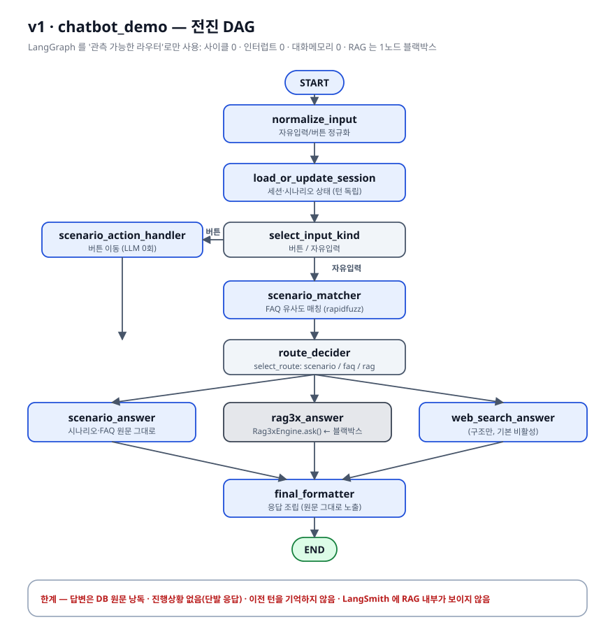
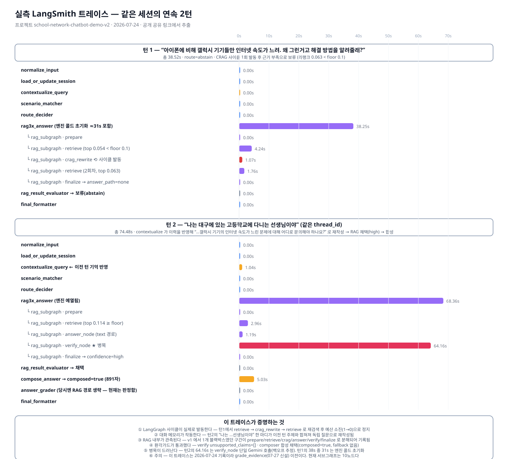

# 파이프라인 비교 — chatbot_demo(v1) vs chatbot_demo_v2

> 그림은 `scripts/render_pipeline.py` 가 생성합니다(외부 도구 불필요).
> `python -m chatbot_demo_v2.scripts.render_pipeline` → `docs/*.svg` 갱신.

---

## 1. 한눈에 보는 차이

| 축 | v1 | v2 |
|---|---|---|
| 그래프 형태 | **전진 DAG** — 한 번 지나간 노드로 절대 돌아오지 않음 | **사이클 3종**(CRAG · 롤백 · 에스컬레이션) |
| 노드 수 | 메인 10 | 메인 14 + RAG 서브그래프 9 = **23** |
| RAG | `Rag3xEngine.ask()` **1노드 블랙박스** | 9노드 **서브그래프**(내부 단계가 전부 보임) |
| 사람 개입 | 없음 | `interrupt()` 기반 **되묻기(HITL)** |
| 대화 기억 | 턴 독립(이전 턴 모름) | `messages` + 체크포인터 + **후속질문 재작성** |
| 답변 | DB 원문 낭독 | **근거 종합·상담체 재구성** + 결정론 환각가드 |
| 사용자 체감 | 요청 → (25~150초 무응답) → 답변 | **SSE 진행상황 실시간 표시** + 👍👎 피드백 |
| 관측(LangSmith) | `rag3x.ask` 한 덩어리 | `prepare/retrieve/crag/answer/verify/rollback/finalize` 개별 run |

---

## 2. v1 — 전진 DAG



**흐름**: `normalize_input → load_or_update_session → (버튼|자유입력) → scenario_matcher →
route_decider → {scenario_answer | rag3x_answer | web_search_answer} → final_formatter → END`

LangGraph 를 썼지만 실제로 얻은 것은 **"어느 분기를 탔는지 기록되는 라우터"** 였습니다.
조건부 엣지 3개가 전부이고, 되돌아오는 엣지·인터럽트·상태 누적이 하나도 없습니다.
`rag3x_answer` 는 어댑터를 통해 `ask()` 를 호출하고 결과 dict 만 받으므로,
검색이 왜 실패했는지·답변이 어떻게 검증됐는지는 그래프 밖(엔진 내부)에 묻혀 있습니다.

---

## 3. v2 — 사이클 · HITL · 메모리 · 서브그래프


### 3.1 메인그래프에서 새로 생긴 것

| 노드 | 하는 일 | 게이트 |
|---|---|---|
| `contextualize_query` | "나는 대구 고등학교 선생님이야" 처럼 **앞 턴에 의존하는 말**을 독립 질문으로 재작성 | 자유입력 + 이전 턴 존재 + `CONTEXTUALIZE_ENABLED` |
| `clarify_node` | FAQ 매칭이 **애매하지만 점수가 높을 때** 후보 2개로 되묻고 `interrupt()` 로 멈춤 | `CLARIFY_ENABLED`, **1·2위 후보 모두** `≥ CLARIFY_MIN_SCORE` |
| `compose_answer` | 근거/원문을 **종합해 상담체로 재구성**. 근거 밖 숫자가 나오면 합성 폐기 | `COMPOSER_RAG/FAQ_ENABLED` |
| `answer_grader` | 답변이 질문을 실제로 해결했는지 판정 → 미해결이면 RAG 로 **에스컬레이션** | `GRADER_ENABLED`, FAQ 경로만 |

세 노드 모두 **실패하면 pass-through** 합니다(LLM 이 죽어도 답변은 나감).
시나리오 버튼 이동·종단답변과 FAQ 정확일치는 v1 과 똑같이 **LLM 0회**입니다.

### 3.2 RAG 를 서브그래프로 쪼갠 이유

`controller_x.py` 의 S0~S8 상태기계를 **로직 수정 없이** 노드로 재배치했습니다.
노드 본문은 vendored 원시함수(`run_retrieval` / `answer_text_from_pages_x` /
`verify_answer` / `rewrite_query` / `_finalize`)를 호출할 뿐입니다.

얻은 것:
1. **관측** — 어느 단계에서 몇 초 걸렸는지, 왜 CRAG 가 돌았는지가 LangSmith 에 남는다.
2. **스트리밍** — 각 노드가 `get_stream_writer()` 로 진행상황을 발신 → SSE 로 브라우저에 표시.
3. **제어의 명시화** — 예산(`crag_budget`·`answer_regen_budget`·`path_switch_budget`)이
   그래프의 조건부 엣지로 드러나, 무한루프 방지가 코드가 아니라 **구조**로 보인다.

동작이 원본과 같은지는 `Rag3xEngine.ask()` 와 결과를 비교하는 통합 테스트로 검증했습니다
(`tests/test_rag_subgraph.py`, `RUN_RAG_INTEGRATION=1` 일 때만 실행).

---

## 4. 실측 — LangSmith 트레이스 2건



같은 세션에서 연달아 던진 두 질문의 실제 실행 기록입니다
(프로젝트 `school-network-chatbot-demo-v2`, 2026-07-24).

### 턴 1 — "아이폰에 비해 갤럭시 기기들만 인터넷 속도가 느려…" (38.52s)

```
chat_turn
├ normalize_input · load_or_update_session · contextualize_query(스킵) · scenario_matcher · route_decider
├ rag3x_answer  38.25s
│  └ rag3x.ask
│     └ rag_subgraph
│        ├ prepare
│        ├ retrieve        4.24s   리랭크 최고 0.054 < floor 0.1
│        ├ crag_rewrite    1.07s   ⟲ "갤럭시 스마트폰과 아이폰 간의 네트워크 속도 차이 원인 및
│        │                            무선 인터넷 성능 최적화 방법" 으로 재작성 (crag_budget 1→0)
│        ├ retrieve        1.76s   재검색해도 0.063 < 0.1
│        └ finalize                answer_path=none → abstain
├ rag_result_evaluator → 보류(웹검색 비활성)
└ final_formatter
```

- **사이클이 실제로 돌았다.** 조건부 엣지 `after_retrieve` 가 `"crag"` 를 반환 → `crag_rewrite` →
  다시 `retrieve`. 예산 소진 후 두 번째는 `"no_answer"` 로 빠져나가 **무한루프가 아님**을 확인.
- **모르는 건 모른다고 했다.** 코퍼스에 아이폰/안드로이드 단말별 속도차 자료가 없어 abstain.
  이것은 결함이 아니라 rag3 의 `rerank_score_floor` 가 의도대로 작동한 결과입니다.

### 턴 2 — "나는 대구에 있는 고등학교에 다니는 선생님이야" (74.48s)

```
chat_turn
├ contextualize_query  1.04s
│    → "대구에 있는 고등학교에 근무하는 선생님인데, 갤럭시 기기의 인터넷 속도가 느린 문제에
│       대해 어디로 문의해야 하나요?"          ← 이전 턴 주제를 합쳐 독립 질문으로 재작성
├ rag3x_answer  68.36s
│  └ rag_subgraph
│     ├ retrieve      2.96s   0.114 ≥ floor → 근거 채택
│     ├ answer_node   1.19s   text 경로
│     ├ verify_node  64.16s   ★ groundedness=supported, unsupported_claims=[] → confidence=high
│     └ finalize
├ rag_result_evaluator → 채택
├ compose_answer  5.03s  → composed=true (891자)
├ answer_grader  (RAG 경로는 판정 생략 — 설계대로)
└ final_formatter
```

이 한 턴이 v2 의 신규 기능 4개를 동시에 증명합니다.

| 확인된 것 | 근거 |
|---|---|
| 대화 메모리 | `messages` 4건(human/ai × 2턴)이 같은 `thread_id` 에 누적 |
| 후속질문 재작성 | 사용자 발화에 없던 "갤럭시 인터넷 속도" 가 재작성 질문에 등장 |
| 근거 종합 | 초안이 아니라 근거 2쪽(`★23년 학교 유무선 운영·관리 안내서 p39`, `자가진단 체크리스트 p4`)을 묶어 **일시적/반복적 × 일부/전체 교실** 4분기 절차로 재구성 |
| 환각가드 통과 | 지원센터 번호 `1588-5509` 는 근거 원문에 실재 → `composer_fallback` 없음 |

### 이 트레이스로 발견한 것 (수정·기록 완료)

| # | 발견 | 조치 |
|---|---|---|
| 1 | 서브그래프 child run 이름이 `LangGraph` 로 찍혀 무슨 그래프인지 안 보임 | `compile(name="rag_subgraph")` 로 명시 (`graph/builder.py`) |
| 2 | 턴1의 38.25s 중 **약 31초가 엔진 콜드 초기화**(설정·백엔드·인덱스 예열) | 첫 질문 전에 `POST /api/warmup` 을 호출하도록 시연 절차에 명시 |
| 3 | 턴2의 `verify_node` 가 **64.16s** — 전체의 86% | 이 턴의 Gemini 호출은 답변 1 + 검증 1뿐인데(`gemini_calls=2`) 답변은 1.19s 였으므로, 검증 1회가 429 백오프에 걸린 것으로 보입니다. 그래프 구조가 아니라 외부 API 지연이라 코드 변경 없이 기록만 했습니다. rag3x 에 `x_conditional_verify_skip`(검증 LLM 생략) 옵션이 있지만 발동 하한이 `x_verify_skip_tau=0.6` 이라 이 질의(0.114)에는 해당하지 않습니다 |
| 4 | `answer_grader` 가 RAG 경로에서 0.00s | **정상** — RAG 는 rag3x 내부 verify 가 이미 판정하므로 중복 판정을 생략하는 설계 |

---

## 5. 같은 질문을 v1 에 넣었다면

| 단계 | v1 | v2 |
|---|---|---|
| "나는 대구 고등학교 선생님이야" | 그대로 RAG 질의 → 근거 없음 → 보류 | 이전 턴과 합쳐 재작성 → 정답 근거 검색 성공 |
| 검색 실패 시 | 즉시 포기 | CRAG 로 질의 재작성 후 1회 재검색 |
| 답변 형태 | 근거 원문 조각 | 절차 4분기로 재구성 + 연락처 · 앱 안내 |
| 대기 중 화면 | 빈 화면 | `근거 검색 중 → 답변 생성 → 검증 → 종합` 단계 표시 |
| 사후 분석 | "RAG 가 38초 걸렸다" | "retrieve 4.2s, CRAG 1.1s, 재검색 1.8s, 리랭크 0.063" |
