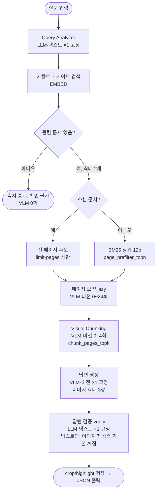

# 카탈로그 기반 Multimodal RAG — 실험 통합 보고서

작성일: 2026-07-14 · 실험 기간: 2026-07-09 ~ 2026-07-13
대상: `test_1차`(rag_catalog_experiment) → `test_2`(rag2) → `test_2_timecost`
원본 출처: 각 실험 폴더의 REPORT.md/README.md와 소스 코드(retrieval.py, answer.py, metrics.py 등) 직접 대조

> 이 문서는 발표자료 제작을 위한 원본 자료입니다. 본문(개요~부록)은 사실 기반 실험 결과만 다루고,
> **작성자 개인 의견은 문서 맨 끝 "작성자 사견" 섹션에 별도로 분리**되어 있습니다.

---

## 한눈에 보는 결론 (TL;DR)

| # | 발견 | 근거 |
|---|---|---|
| 1 | **카탈로그의 효용은 파이프라인이 결정한다** | test_1차: 문서 선정 정확도 **1.000 vs 0.250**(카탈로그 압승) → test_2: 같은 지표가 **0.692 vs 0.923**으로 반전(카탈로그 열세) |
| 2 | **소요시간은 모델 호출 횟수에 좌우된다** | test_1차는 **19.5초~312.6초**(최대 16.9배)까지 벌어지지만, test_2는 호출을 최대 2회로 고정해 **30~35초**에 수렴 |
| 3 | **카탈로그의 한계는 반복된다** | 두 파이프라인 모두 **형제 문서 혼동**·**세부 키워드 누락** 패턴이 독립적으로 재현됨 |

---

## 0. 공통 배경

세 실험은 모두 같은 코퍼스와 같은 기반 모델을 공유한다. 달라지는 것은 문서를 **언제, 무엇으로 파싱**하고
**카탈로그를 검색에 얼마나 쓰는가** — 즉 파이프라인 구조다.

**코퍼스**
- 대상 PDF 문서 13종, 총 969페이지
- 텍스트 문서 11개(775페이지, 텍스트 레이어 대부분 90~100%)
- 스캔 문서 2개: `WEISS-DS-001-현황분석서-v0.91.pdf`(100p, 텍스트 레이어 0), `스마트 단말 관리 시스템[MDM] 교육 매뉴얼`(94p 중 11p만 텍스트)

**공통 모델/인프라 스택**

| 구분 | 값 |
|---|---|
| LLM / VLM | `gemma4:12b` (Ollama) |
| 폴백 모델 | `gemma4:e4b` (OOM/로드 실패 시 1회 자동 재시도) |
| 임베딩 | `embeddinggemma` (task prefix 적용) |
| 벡터 DB | Chroma |
| 검색 융합 | BM25 + dense, RRF(k=60) |
| 미사용 | `gemma4:26b`(17GB) — 16GB VRAM 초과 |

---

## 1. [기] test_1차 — 카탈로그 게이트 + VLM 기반 Multimodal RAG

모든 PDF를 한 번에 RAG하지 않는다는 것이 출발점이었다. 카탈로그(Excel 설명문)로 후보 문서를 **2개 이하**로
먼저 좁힌 뒤, 그 문서에만 VLM(비전 언어모델) 기반 RAG를 수행하는 query-time 파이프라인.

### 1.1 파이프라인



**왜 lazy인가**: 969페이지 전체를 미리 요약+청킹하면 로컬에서 5시간 이상 걸린다. `ingest`는 VLM을
한 번도 호출하지 않고(임베딩만), 페이지 요약·청킹은 `ask` 시점에 선정된 문서의 상위 후보 페이지에만
만들어 디스크 캐시에 저장한다.

### 1.2 모델 호출 지점 — 정확한 횟수 (코드 확인)

| 단계 | 모델 | 호출 시점 | 문항당 횟수 |
|---|---|---|---|
| Query Analyzer | LLM(text) | 항상, 게이트 통과 여부와 무관 | **1 고정** |
| 페이지 요약 | VLM(vision) | 캐시 미스 (doc,page)마다 | 0 ~ 24 |
| Visual Chunking | VLM(vision) | 상위 4페이지 중 캐시 미스만 | 0 ~ 4 |
| 답변 생성 | VLM(vision) | 문서·페이지가 있으면 | **1 고정** |
| 답변 검증 | LLM(text) | 답변이 있으면 (이미지 재검증은 기본 꺼짐) | 1 (+옵션 1) |

문서를 찾고 답변까지 갈 때 **고정 호출 3회**(분석·답변·검증)는 항상 나가고, 여기에 **가변 VLM 호출**
(페이지 요약 0~24 + 청킹 0~4)이 더해진다. 실측 avg_vlm_pages(§2: catalog 1.4 · no_catalog 3.6 ·
filename_only 30.6)가 바로 이 가변 구간의 크기이며, 이는 §4 소요시간 변동의 직접적 원인이다.

**기술 세부 — RRF 정규화(B2 버그의 근거)**

```
RRF(d) = Σ 1 / (k + rank_i(d))   for i in {bm25, dense}
최댓값 = 2 / (k + 1) = 2 / 61 ≈ 0.0328   (k=60)
```

원점수 최댓값이 0.033인데 최초 게이트는 0.35였다 — 이론적으로 도달 불가능한 값이라 완벽히 일치하는
문서조차 항상 거절됐다(B2). 수정은 원점수를 이론적 최댓값으로 나눠 0~1로 정규화하는 것이었다.

### 1.3 모델 구성과 특이점

| 용도 | 모델 | 비고 |
|---|---|---|
| LLM (질문 분석·검증) | `gemma4:12b` | 7.6GB, 16GB VRAM에 여유 |
| VLM (요약·청킹·답변) | `gemma4:12b` | vision 지원 — LLM과 동일 가중치, 호출 방식만 다름 |
| Fallback | `gemma4:e4b` | OOM/로드 실패 시 1회 자동 재시도 |
| Embedding | `embeddinggemma` | task prefix 적용 |

- Chroma 4개 컬렉션(catalog/page/visual_chunk/filename), backend_id로 디렉터리 분리
- 토크나이저 기본 `char_bigram`(형태소분석기 없이 근사)
- VLM 입력 이미지 최대 1280px, 페이지 렌더링 DPI 150

### 1.4 Smoke test 3건 (실제 모델)

| 질문 | 검증 대상 | 결과 |
|---|---|---|
| 무선 AP 장애 발생 시 조치 절차를 알려줘 | 정상 경로 | **통과** — 문서 2개 선정, 근거 2건, bbox 육안 검증 완료 |
| 전국 교육청의 무선망 현황 분석 결과를 알려줘 | 텍스트 레이어 0인 스캔 문서에서 답이 나오는가 | **통과** — 표 숫자 추출 성공, 단 **전사 오류 실측** |
| 김치찌개 맛있게 끓이는 방법 알려줘 | 무관한 질문을 거절하는가 | **통과** — selected_documents: [], 1초 미만 |

**실측된 VLM 전사 오류**: 스캔 문서의 조밀한 표를 옮기며 숫자를 잘못 읽었다 — 가온 27,054 → 27,004,
제조사 '엘텍' → '엘벨' (학교 수 1,368 / AP 총량 83,375 / 올레디오 30,739는 정확). 이후 두 실험 모두
"답변 숫자는 원본과 대조 후 신뢰할 것"이라는 원칙의 근거가 됐다.

### 1.5 실제 모델로만 드러난 버그 5건

mock 모드에서는 재현되지 않았다 — 실제 임베딩·Chroma·VLM이 있어야 드러나는 버그들.

| ID | 증상 | 원인 | 수정 |
|---|---|---|---|
| B1 | ingest가 "dimension of 64, got 768"로 죽음 | mock(해시 64차원)과 실제(768차원) 임베딩이 같은 Chroma 디렉터리 공유 | backend_id로 인덱스 디렉터리 분리 |
| B2 | 완벽히 매칭되는 문서조차 항상 거부됨 | `min_doc_score=0.35`를 RRF 원점수와 비교 — 이론적 최댓값 2/61≈0.033이라 도달 불가 | RRF 점수를 최댓값으로 정규화 |
| B3 | Chroma HNSW 인덱스 손상, count()조차 실패 | Chroma 1.5.9 컬렉션 손상(원인 미상) | 손상 감지 시 컬렉션 삭제·재생성 후 1회 재시도 |
| B4 | "김치찌개" 질문이 문서를 선정하고 13분간 VLM 낭비 | RRF는 상대 순위만 반영 — 문서 13개 중 무엇이든 1등 존재(상대 점수 0.98) | dense cosine 유사도 절대 하한선 신설(김치 0.043 vs 정상 0.44~0.64) |
| B5 | 답변이 "(이미지 1)"을 지목하는데 JSON엔 정보 없음 | image_index를 조회에만 쓰고 출력에서 버림 | `page_evidence[].image_index` + `source_images[]` 매니페스트 추가 |

---

## 2. [승] 카탈로그가 실제로 이득인가 — 3모드 비교

1차 실험이 "동작하는가"에 답했다면, 이 라운드는 원 질문 "**데이터 카탈로그가 RAG의 비용과 정확도에
실제로 도움이 되는가**"에 숫자로 답하기 위해 동일 질문셋을 세 가지 문서 선정 방식으로 나란히 돌렸다.

- **catalog**: 카탈로그 설명문으로 문서 ≤2개 선정
- **no_catalog**: page_index 전역 검색 후 문서 역산
- **filename_only**: 파일명·폴더명만 색인(baseline) — 카탈로그 효과가 설명문 내용 때문인지 파일명만으로 충분한지 분리

### 2.1 문서 선정 정확도 & 소요시간 — human_20 평가셋 (VLM 호출 0회, depth=docs)

카탈로그 "대표 예상 질문" 13개 문서 전부 커버 + 무관 질문 4개, 총 20문항.

| mode | doc_recall@k | doc_mrr | 무관질문 거절률 | 평균 소요시간(초) | avg_selected_docs |
|---|---|---|---|---|---|
| **catalog** | **1.000** | **0.906** | 1.000 (4/4) | 19.6 | 1.6 |
| filename_only | 0.500 | 0.438 | 1.000 (4/4) | 19.5 | 1.4 |
| no_catalog | 0.250 | 0.188 | 1.000 (4/4) | 19.6 | 1.5 |

> **VLM이 한 번도 호출되지 않는 구간에서는 카탈로그 유무가 속도에 거의 영향을 주지 않는다** — 이 대칭이
> 아래 qa_sample(VLM 호출 발생)에서 완전히 무너진다.

### 2.2 답변 품질과 비용 — qa_sample_20 (실사용자 헬프데스크성 질문, depth=answer)

"갤럭시탭 Wi-Fi 연결법"류 최종 사용자 질문 20개(12개 장애 유형 카테고리 층화 표본) — 인프라 구축·운영
문서 13종과는 성격이 다른, 코퍼스 밖에 가까운 질문셋.

| mode | 답변 시도 | token_f1 (평균) | 키워드 recall | 거절률 | avg vlm_pages/질문 | avg 소요시간/질문 |
|---|---|---|---|---|---|---|
| **catalog** | 1/20 (5%) | 0.484* | 0.636* | 95% | **1.4** | **36.8초** |
| no_catalog | 18/20 (90%) | 0.172 | 0.164 | 10% | 3.6 | 219.2초 |
| filename_only | 16/20 (80%) | 0.153 | 0.152 | 20% | 30.6 | 312.6초 |

*catalog의 token_f1/키워드 recall은 답변을 시도한 **1문항만**의 값 — 표본이 1개뿐이라 방향성 참고용.

catalog는 95%를 "확인 불가"로 스스로 거절했다. no_catalog·filename_only는 대부분 답을 시도했지만
token_f1은 더 낮고, 비용은 2.6~22배, 시간은 6~8.5배 들었다.

### 2.3 문서 선정 게이트 임계값 분포 (실측)

현재 게이트가 정답 문서까지 걸러내고 있는지 확인.

| mode | 게이트 파라미터 | 현재 값 | 관련 문서 최저 점수 | 무관 문서 최고 점수 |
|---|---|---|---|---|
| catalog | min_dense_similarity | 0.350 | 0.368 | 0.129 |
| no_catalog | min_page_dense_similarity | 0.350 | 0.410 | 0.204 |
| filename_only | min_filename_dense_similarity | 0.300 | **0.223 ⚠️** | 0.096 |

⚠️ filename_only만 게이트(0.300)가 관련 문서 최저 점수(0.223)보다 높다 — 파일명만으로 약하게 매칭되는
정답 질문을 게이트가 먼저 버릴 위험이 실측으로 확인됐다.

### 2.4 core_16 독립 평가와 카탈로그 개선

**B6 — 인프라 버그가 "게이트 거절"로 오진단됨(중요)**: 이 라운드 첫 실행에서 catalog가 16문항 전부를
거절했다. 원인은 게이트 캘리브레이션이 아니라 **Chroma 컬렉션(catalog_index)이 통째로 비어 있었던 것**
(count=0) — 이전 세션의 Chroma 손상 자가복구(B3)가 컬렉션을 재생성했지만 재생성분은 비어 있었고,
ingest를 다시 돌리지 않으면 복구되지 않는 비대칭을 놓치고 있었다. ingest 재실행으로 복구 후 재평가.

인덱스 복구 후 catalog 모드 실측(core_16, VLM 0회):

| 지표 | 값 |
|---|---|
| doc_recall@k | 0.692 (13개 중 9개) |
| doc_mrr | 0.654 |
| rejection_accuracy | 1.000 (무관 질문 3/3) |

놓친 4개(core_002/003/007/012) 중 3개는 **"형제 문서" 혼동** — 통합관제 매뉴얼 4종(이용기관/사용자/
최고관리자/이용관리), 완료보고서 3번↔4번처럼 같은 제품군을 대상 사용자별로 나눈 문서를 카탈로그
설명문만으로는 구분하기 어려웠다.

**신규 카탈로그(문서 범위 컬럼 추가) A/B 테스트**: 대상 사용자·역할을 명시한 "문서 범위" 컬럼을 추가한
새 Excel로 재색인한 결과:

| 지표 | 기존 카탈로그 | 신규 카탈로그 | 변화 |
|---|---|---|---|
| doc_recall@k | 0.692 (9/13) | **0.769 (10/13)** | +1건 |
| doc_mrr | 0.654 | **0.692** | 개선 |
| rejection_accuracy | 1.000 | 1.000 | 유지 |

core_012(최고관리자 대시보드 Traffic TopN)가 miss→hit로 전환 — 새 텍스트가 질문의 "최고관리자"와 직접
매칭됐다. 다만 남은 3건(core_002/003/007)은 형제 문서 혼동과는 다른 원인(카탈로그 설명문에 "UTM" 단어
자체 부재, 서로 다른 facet 서술, 경쟁 문서에 밀림)으로 갈렸다 — 카탈로그 설명은 **"문서 단위 요약"**
이라 문서 내부 세부 절차·표까지는 근본적으로 반영하지 못한다는 한계로 수렴한다(A14).

---

## 3. [전] test_2 — MinerU 기반 하이브리드 텍스트 RAG

파이프라인을 근본적으로 다시 설계했다 — 이어지는 실험이 아니라 **비용 구조를 바꾼 재설계**다.

### 3.1 왜 파이프라인을 바꿨나 — test_1차와의 연결점

test_1차에서 no_catalog가 비쌌던 이유는 문서 범위를 좁히지 않으면 다수 페이지에 대해 **query-time에
VLM 요약을 새로 호출**해야 했기 때문이다(§2, 질문당 평균 3.6~30.6페이지 VLM 호출). test_2는 이 비용
자체를 없애기로 했다 — **ingest 단계에서 969페이지 전부를 MinerU로 미리 파싱**해 page_index에
텍스트·표를 넣어두면, query-time에는 VLM 요약이 아예 필요 없다.

### 3.2 파이프라인

```mermaid
flowchart TD
    A([질문 입력]) --> B["MinerU pipeline 파싱
규칙·Ingest 1회
969p 사전 1회, 질문과 무관"]
    B --> C["질문 임베딩
EMBED ×1 고정"]
    C --> D["카탈로그 게이트 catalog 모드
no_catalog는 이 단계 건너뜀"]
    D --> E{관련 문서 있음?}
    E -- 아니오 --> F([즉시 종료: 확인 불가
답변 호출 0회])
    E -- 예 --> G["page_index 검색
모델 호출 없음"]
    G --> H{그림 또는 스캔+표?}
    H -- 예: vision --> I1[figure_area≥0.5 또는
스캔+표(숫자 교차확인)]
    H -- 아니오: text --> I2[일반 텍스트/구조화 표]
    I1 --> J
    I2 --> J["답변 생성 — 정확히 1회
LLM 또는 VLM 택1"]
    J --> K([JSON 출력])
```

### 3.3 모델 호출 지점 — 정확한 횟수

| 단계 | 모델 | 호출 시점 | 문항당 횟수 |
|---|---|---|---|
| 질문 임베딩 | Embedding | 항상, 게이트 이전 | **1 고정** |
| 문서/페이지 라우팅 | 모델 없음(메타데이터 규칙) | - | 0 |
| 답변 생성 | LLM 또는 VLM | 근거 페이지가 있으면, text/vision 택1 | 0 또는 1 |

문항당 총 모델 호출은 **최대 2회(임베딩 1 + 답변 1)**로 상한이 고정된다. test_1차처럼 페이지 수·문서
유형에 따라 늘어나는 가변 구간이 구조적으로 존재하지 않는다.

**기술 세부 — MinerU content_list.json 스키마** (pipeline 백엔드, mineru 3.4.4 실측):

```
{ "type": "text" | "table" | "image" | "chart",
  "text" | "table_body" | "img_path": ...,
  "bbox": [x0,y0,x1,y1],   // 0~1000 정규화 좌표
  "page_idx": 0-based 페이지 번호 }
```

표는 `table_body`에 **HTML 그대로** 담겨(colspan/rowspan 보존) LLM에 전달된다 — 마크다운 변환 시
병합 셀 정보가 유실되기 때문이다. 스캔 페이지는 MinerU 내장 CJK OCR로 채워지며, 실측 사례(core_001
DR요금표)에서 100M/500M 숫자가 원본과 100% 일치했다.

숫자 정확도 대책도 다르게 접근했다 — 별도 verification 호출 대신, 비전 경로 프롬프트 자체를
**"표를 먼저 그대로 옮겨 적고, 그 값만으로 답하라"**(transcribe-then-answer)는 단일 호출로 설계해
오독을 억제한다.

### 3.4 모델 구성과 특이점

- 파서: **MinerU pipeline** — 레이아웃+표+OCR 전용, VLM 아님, 결정론적
- 모델 호출: **임베딩 1회 + 답변 1회**로 고정
- Query Analyzer·verify 단계 **제거**
- 토크나이저 기본 `kiwi`(형태소 분석) — test_1차는 `char_bigram`
- 답변 이미지 DPI 200 · 최대 2048px(고해상도) — test_1차는 1280px

### 3.5 test_1차 대비 무엇이 달라졌나

| | test_1차 | test_2 |
|---|---|---|
| 페이지 파싱 시점 | query-time, lazy (선택된 문서에만) | ingest-time, 969p 전량 1회 |
| 페이지 파싱 도구 | VLM 요약(gemma4:12b) | MinerU pipeline(결정론적, VLM 아님) |
| 경로 라우팅 | LLM/VLM 판단 | 페이지 메타데이터 규칙(모델 호출 없음) |
| 문항당 모델 호출 상한 | 이론상 최대 30회(분석1+요약24+청킹4+답변1+검증1) | 2회(임베딩1+답변1) |
| 문항당 모델 호출 하한 | 1회(관련 문서 없어도 Query Analyzer는 실행) | 1회(임베딩만, 답변 없이 종료 가능) |

---

## 4. [결] test_2_timecost — 같은 실험, 반대의 결과

test_1차 §2의 "카탈로그 유무 비교"를 test_2 파이프라인 위에서 그대로 재현했다. `rag2` 패키지는
수정하지 않고 import만 했고, 기존 인덱스·캐시를 그대로 재사용했다. 평가셋은 core 13문항 + 무관 질문
3문항, 총 16문항.

### 4.1 배선 정합성 확인

이 실험의 catalog 모드는 rag2의 프로덕션 코드(`run_retrieval`)를 그대로 호출한다. rag2 자체 baseline
평가와 대조한 결과 doc_hit 0.692, page_hit 0.538, kw 0.423, 무관거절 1.0, 답변경로 11/0/5 — **모든
정확도 지표가 완전히 일치**했다(소요시간만 35.47초 vs 35.34초로 자연 변동). 아래 반전은 배선 오류가
아니다.

### 4.2 반전 — test_1차 vs test_2_timecost

| 실험 | catalog | no_catalog | 승자 |
|---|---|---|---|
| test_1차 human_20 · doc_recall@k | 1.000 | 0.250 | **카탈로그 압승** |
| test_2_timecost core_16 · doc_hit | 0.692 | 0.923 | **카탈로그 없는 쪽 우세** |

### 4.3 test_2_timecost 전체 지표 (16문항)

| mode | doc_hit | page_hit | kw_hit | 무관거절 | avg_모델호출 | avg_초 | 총_초 |
|---|---|---|---|---|---|---|---|
| catalog | 0.692 | 0.538 | 0.423 | 1.000 | 1.688 | 35.339 | 565.420 |
| no_catalog | 0.923 | 0.769 | 0.705 | 1.000 | 1.812 | 30.491 | 487.860 |

### 4.4 왜 뒤집혔나 — 반전 사례 3건

| 질문 | catalog 결과 | 원인 |
|---|---|---|
| core_002 (UTM 장비 제조사) | 게이트 자체 거절 | dense_similarity 0.342 < 0.35 — 카탈로그 설명문에 "UTM"이라는 단어 자체가 없음. no_catalog는 페이지 원문에 "UTM"이 그대로 있어 바로 찾음 |
| core_003 (사용자 요구사항 5가지) | 완전히 다른 문서 선택 | catalog는 현황분석서·이용관리 매뉴얼을 선정. no_catalog는 정답 문서와 형제 문서를 함께 찾아 정답 포함 |
| core_012 (최고관리자 대시보드 Traffic TopN) | 게이트에서 완전 거절 | no_catalog는 통합관제(사용자)·통합관제(최고관리자) 형제 문서 둘 다 찾아 정답 포함 |

### 4.5 원인 — 파이프라인 구조가 승자를 바꾼다

**원인 1 — 비용 구조 자체가 다름**: test_2는 ingest 단계에서 969페이지 전부를 이미 MinerU로 저비용
파싱해 두었다. 카탈로그로 문서를 좁히든 안 좁히든 **페이지 검색 자체의 비용은 동일**하다(BM25+dense는
969p 전체를 훑어도 임베딩 1회 수준). 두 모드의 실질 비용 차이는 마지막 답변 호출 1회뿐이라, 카탈로그가
없앨 수 있는 비용이 test_1차보다 훨씬 작다.

**원인 2 — 카탈로그 게이트가 정답을 놓친 사례가 실재**: 위 3건처럼 카탈로그 설명문에 없는 세부
키워드거나 형제 문서 혼동인 경우, no_catalog의 "문서 원문 텍스트 전역 검색"이 카탈로그가 놓치는 부분을
메웠다. test_1차에는 이런 저비용 전역 원문 검색 대안이 없었다(있었다면 VLM 비용이 폭증했을 것).

### 4.6 한계

문항 16개(무관 질문 3개 포함)로 표본이 작다 — 세 반전 사례의 방향성은 명확하지만 통계적으로 유의하다고
주장하기는 어렵다. no_catalog도 page_match 기준으로는 아직 완벽하지 않고(0.769), Ollama 응답시간
자체의 실행별 변동이 커서(core_003: catalog 140.1초 vs no_catalog 18.2초) 개별 문항의 초 단위
비교보다 평균/총합으로 판단하는 것이 안전하다. 카탈로그 13행이라는 소규모 자체가 원인일 수 있어, 문서
수가 훨씬 많아지면(예: 249행 전체) 카탈로그의 "범위 좁히기" 효과가 다시 우세해질 가능성이 있다.

---

## 5. 소요시간 분석 — 무엇이 응답 시간을 결정하는가

test_2_timecost라는 실험명 자체가 시간 비용을 정면으로 다룬다. 정확도만큼 소요시간도 두 파이프라인의
설계 철학을 가르는 축이다.

### 5.1 같은 "초" 단위, 세 가지 다른 상황

| 실험 | catalog | no_catalog | filename_only | 비고 |
|---|---|---|---|---|
| ① test_1차 human_20 (VLM 0회, docs depth) | 19.6초 | 19.6초 | 19.5초 | 세 모드 사실상 동일 |
| ② test_1차 qa_sample (VLM 1.4~30.6p, answer depth) | 36.8초 | 219.2초 | 312.6초 | 16.9배 차이 |
| ③ test_2_timecost core_16 (호출 최대 2회 고정) | 35.3초 | 30.5초 | — | 1.16배, 거의 고정 |

①은 세 모드가 사실상 동일(19.5~19.6초, 오차범위) — VLM이 아예 호출되지 않기 때문이다. ②는 같은
test_1차 파이프라인인데도 **16.9배(36.8초→312.6초)**까지 벌어진다 — 유일한 차이는 카탈로그가 걸러낸
VLM 페이지 요약 호출 수(1.4 vs 30.6페이지)뿐이다. ③은 애초에 이런 변동이 발생할 수 없는 구조라
30~35초 근방에서 거의 고정된다.

### 5.2 기술 세부 — 페이지 수와 시간이 완벽히 비례하지는 않는다

qa_sample의 세 지점 (1.4p, 36.8초) · (3.6p, 219.2초) · (30.6p, 312.6초)을 그대로 나누면 페이지당
26.3초 / 60.9초 / 10.2초로 **일정하지 않다** — no_catalog가 catalog보다 페이지 수는 2.6배인데 시간은
6배다. test_1차의 no_catalog 경로(`_retrieve_pages_global`)는 후보 상한(no_catalog_page_prefilter_topn=24)
안의 페이지 전부에 대해 **문서 파싱과 승격 판단을 먼저 수행한 뒤** 재질의하는 2단계 구조라, 실제 VLM
호출 수가 적어도(3.6p) 후보를 훑는 오버헤드 자체가 문서 선정형(catalog) 경로보다 크게 남는 것으로
보인다. 즉 **VLM 호출 수는 소요시간의 주된 동인이지만 유일한 동인은 아니다.**

### 5.3 기술 세부 — test_2 모델 호출 수의 실측 검증

test_2_timecost REPORT의 `avg_모델호출`(catalog 1.688 · no_catalog 1.812)은 파이프라인의 "최대 2회"
상한과 정확히 들어맞는다 — 답변 경로 분포(text/vision/none)로 직접 검산된다:

```
total_model_calls = embed_calls + text_answer_calls + vision_answer_calls
문항이 답변(text/vision)하면: 1(embed) + 1(answer) = 2회
문항이 거절(none)되면:        1(embed) + 0        = 1회

catalog    (경로 11/0/5): (11×2 + 0×2 + 5×1) / 16 = 27/16 = 1.688  ✓ 실측치와 일치
no_catalog (경로 12/1/3): (12×2 + 1×2 + 3×1) / 16 = 29/16 = 1.8125 ✓ 실측치와 일치
```

모든 문항이 최대 2회 호출로 상한이 걸려 있으므로, 어떤 질문이 들어와도 응답 시간의 "긴 꼬리"가
구조적으로 발생하지 않는다 — test_1차와 가장 뚜렷하게 갈리는 지점이다.

---

## 6. 결론 — 이 세 실험이 실제로 보여주는 것

세 실험을 하나로 겹치면, 개별 REPORT 안에서는 보이지 않던 인과관계가 드러난다.

### 6.1 핵심 결론 3가지

**1) 카탈로그의 효용은 "query-time에 값비싼 모델 호출이 얼마나 남아있는가"로 결정된다.**
test_1차처럼 문서를 좁힌 뒤에도 페이지 요약(VLM, 최대 24회)이 남아있는 구조에서는, 카탈로그가 그 호출
자체를 없애 정확도(doc_recall 1.000 vs 0.250)와 속도(qa_sample 36.8초 vs 최대 312.6초)를 동시에 크게
개선했다. test_2처럼 ingest 시점에 이미 전량 파싱을 끝내 query-time에 임베딩 1회+답변 1회만 남는
구조에서는, 카탈로그가 절감할 호출 자체가 없어 이득이 사라지고 게이트 오탐만 남아 손해(doc_hit 0.692
vs 0.923)로 반전된다.

**2) 소요시간은 모델 호출 횟수에 좌우되도록 설계된 결과다.**
test_1차는 VLM 페이지 요약 호출 수가 0~24+회로 크게 변하므로 소요시간도 19.5초(VLM 0회)부터 312.6초
(VLM 30.6페이지)까지 16배 이상 벌어진다. test_2는 아키텍처가 호출을 임베딩 1회+답변 1회로 상한
고정해, 어떤 질문이 오든 30~35초 근방에 수렴한다 — test_2는 처음부터 "느린 꼬리"가 구조적으로 존재할
수 없다.

**3) 카탈로그의 정확도 한계는 두 파이프라인에서 같은 패턴으로 반복된다.**
"형제 문서 혼동"(통합관제 매뉴얼 4종 등)과 "카탈로그 설명문에 없는 세부 키워드 누락"(UTM 등)이
test_1차 §2와 test_2_timecost §4 양쪽에서 독립적으로 재현됐다. 우연한 노이즈가 아니라 "카탈로그
설명문 = 문서 단위 요약"이라는 접근 자체의 구조적 한계로 수렴한다는 뜻이다.

### 6.2 종합 대조표

| | test_1차 (rag_catalog_experiment) | test_2 (rag2) |
|---|---|---|
| 페이지 파싱 시점 | query-time lazy (선택 문서 상위 후보 페이지만) | ingest-time 전량 (969p 1회 MinerU 파싱) |
| 페이지 파싱 도구 | VLM 요약(gemma4:12b) | MinerU pipeline(결정론적, VLM 아님) |
| 문항당 모델 호출 상한 | 이론상 최대 30회(분석1+요약24+청킹4+답변1+검증1) | 2회(임베딩1+답변1) |
| 라우팅 방식 | LLM/VLM 판단 기반 | 페이지 메타데이터 결정론적 규칙 |
| 토크나이저 기본값 | char_bigram | kiwi(형태소 분석) |
| 응답시간 변동폭(실측) | 19.5초 ~ 312.6초 (16.9배) | 30.5초 ~ 35.3초 (1.16배) |
| 카탈로그 문서선정 정확도 | 압도적 우세(1.000 vs 0.250) | 열세(0.692 vs 0.923) |
| 우세의 원인 | query-time VLM 비용을 카탈로그가 크게 절감 | 페이지 검색 비용이 이미 낮아 절감 효과 작음, 게이트 오탐·형제 문서 혼동의 손해가 더 큼 |

---

## 7. 부록 — 재현 방법과 산출물 위치

### 7.1 test_1차 재현

```
cmd /c conda activate intern_chatbot && pip install -r rag_catalog_experiment/requirements.txt
python -m rag_catalog_experiment ingest
python -m rag_catalog_experiment ask "무선 AP 장애 발생 시 조치 절차를 알려줘"
python -m rag_catalog_experiment compare --eval-file eval_sets/human_20.json \
    --modes catalog no_catalog filename_only --depth docs
```

### 7.2 test_2 / test_2_timecost 재현

```
cmd /c conda activate intern_chatbot && python "test_2/rag2/__main__.py" check --skip-indexes
cmd /c conda activate intern_chatbot && python run_experiment.py   # test_2_timecost/ 기준
```

### 7.3 산출물 위치

| 무엇 | 어디 |
|---|---|
| test_1차 보고서 | `rag_catalog_experiment/REPORT.md` |
| test_1차 결과 요약 | `rag_catalog_experiment/results/00_SUMMARY.md` |
| test_1차 근거 이미지 | `outputs/evidence/{run_id}/` (crop/highlight jpg) |
| test_2_timecost 보고서 | `test_2_timecost/results/REPORT.md` |
| test_2_timecost 원본 비교 JSON | `test_2_timecost/results/compare_{timestamp}.json` |

---

## 작성자 사견 (사실 보고가 아님)

> 아래는 개인 의견이며, 위 본문(0~7장)의 사실 기반 보고와는 별개다.

### 헤드라인은 "카탈로그가 좋다/나쁘다"가 아니어야 한다

두 실험을 나란히 보면 진짜 결론은 "카탈로그 도입 여부"가 아니라 **"검색 비용 구조가 검색 전략의
가치를 결정한다"**는, 더 일반화 가능하고 방어력 있는 원칙이라고 생각한다(§6.1의 발견 1과 같은
결이다). query-time에 비싼 모델 호출이 남아 있는 파이프라인일수록 카탈로그 같은 사전 필터의 가치가
크고, ingest 단계에서 이미 저비용 전량 색인이 끝난 파이프라인일수록 그 가치는 줄어든다. 발표에서 이
원칙을 먼저 던지고 두 실험을 근거로 제시하는 순서가, "1차에선 맞았는데 2차에선 틀렸다"는 인상보다
훨씬 설득력 있을 것이다.

### 표본 크기에 대한 경고를 발표에서도 유지할 것

test_1차 qa_sample의 catalog 답변 표본은 **1건**이고, test_2_timecost는 **16문항**이다. 두 반전 모두
방향성은 뚜렷하지만(1.000 vs 0.250, 0.692 vs 0.923 같은 큰 격차는 노이즈로 보기 어렵다), "token_f1
0.484" 같은 n=1 수치를 단독으로 인용하면 발표에서 반박당하기 쉽다. 이 수치는 "방향성 참고"라는 단서와
함께만 쓰는 것을 권한다.

### B6는 결과보다 더 중요한 교훈일 수 있다

Chroma 인덱스 손상이 "게이트가 너무 엄격하다"는 그럴듯한 가설로 위장된 사례(B6)는, 결과가 이상하게
좋거나 나쁘게 나올 때 **먼저 인프라 상태(컬렉션 count 등)를 의심하라**는 방법론적 교훈으로서 이
프로젝트 전체에서 가장 재사용 가치가 높은 발견이라고 본다. 다음 실험부터는 평가 실행 전 "컬렉션
count가 기대치와 일치하는가"를 표준 체크리스트에 넣는 것을 제안한다.

### 카탈로그의 A14 한계는 우연이 아니라 패턴이다

test_1차의 core_002/003/007과 test_2_timecost의 core_002/003/012가 겹치거나 같은 유형(형제 문서
혼동, 카탈로그 설명문에 세부 키워드 부재)으로 반복해서 나타난다. 이건 카탈로그 설명문 컬럼을
세분화하는 것으로는 완전히 해결되지 않는, **"문서 단위 요약"이라는 접근 자체의 구조적 한계**로
보인다. 두 REPORT가 공통으로 이미 언급한 "카탈로그 매칭 실패 시 no_catalog로 부분 fallback"하는
하이브리드 라우팅이, 컬럼을 더 추가하는 것보다 다음 우선순위로 더 근본적이라고 생각한다.

### 다음 실험 우선순위 (개인 의견)

1. 카탈로그를 249행 전체로 확장한 뒤 두 파이프라인에서 재실험 — 두 REPORT가 공통으로 다음 순위로
   지목했고, "문서 수가 늘면 카탈로그가 다시 우세해질 것"이라는 가설을 직접 검증할 수 있다.
2. test_2에 카탈로그 게이트 실패 시 no_catalog로 넘어가는 하이브리드 라우팅을 실험적으로 추가 —
   임베딩 1회+답변 1회라는 저비용 구조 위에서는 "문서 선정 1회 재시도" 정도는 비용 부담이 크지 않을
   것이다.
3. 두 비교 실험 모두 표본을 20~30문항 이상으로 확장해 반전의 통계적 신뢰도를 높인다.
